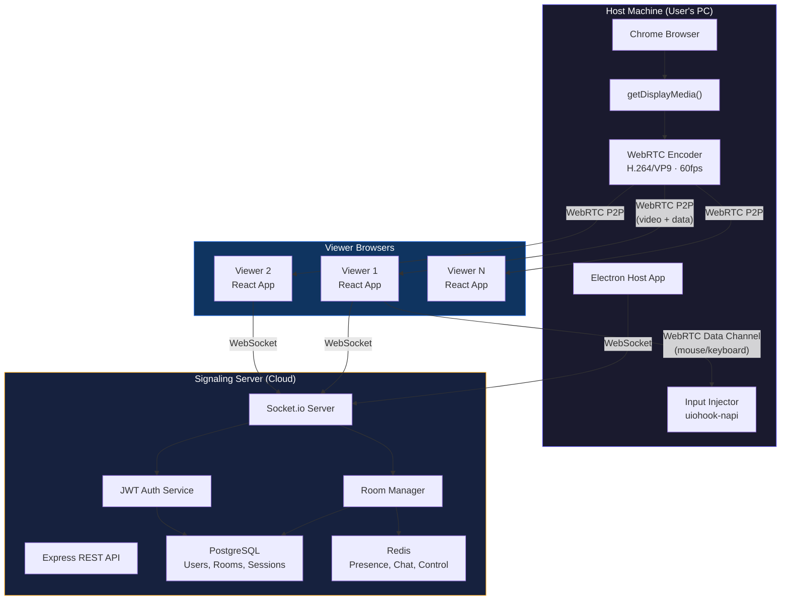
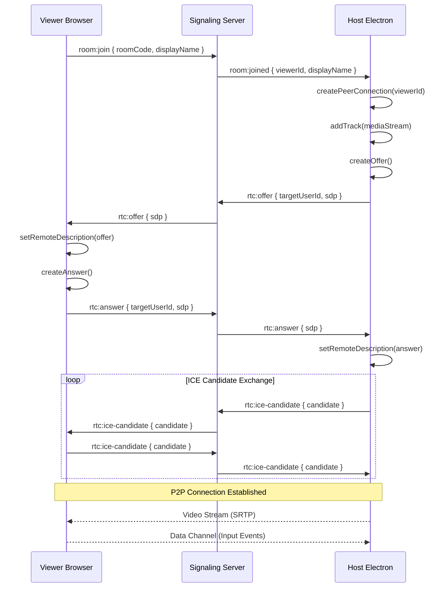
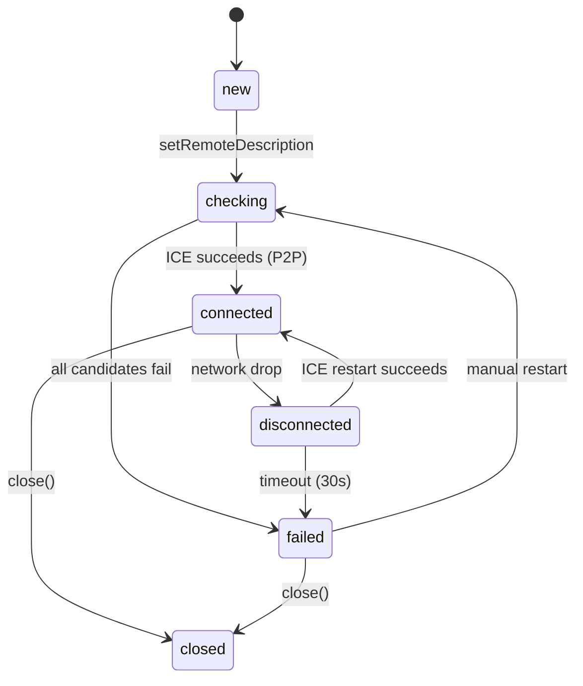
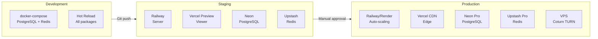

# BrowSync — Technical Requirements Document (TRD)

> **Version**: 1.0 · **Last Updated**: 2026-06-01 · **Status**: Draft
> **Built by**: 🧠 Orchestrator Agent · **Primary Agents**: 🖥️ Agent B (Server), 💻 Agent D (Desktop)

---

## 1. System Overview

### Architecture
BrowSync follows a **three-tier architecture** connected via WebRTC (media/data) and WebSocket (signaling):



### Communication Channels

| Channel | Protocol | Purpose | Data |
|---------|----------|---------|------|
| Media transport | WebRTC (SRTP) | Video stream host→viewer | H.264/VP9 encoded frames |
| Input events | WebRTC Data Channel | Mouse/keyboard viewer→host | JSON input events |
| Signaling | WebSocket (Socket.io) | Peer discovery, room events | Offers, answers, ICE, chat |
| REST API | HTTPS | Auth, room CRUD | JSON payloads |

---

## 2. Technology Stack

| Layer | Technology | Version | Justification | Agent |
|-------|-----------|---------|---------------|-------|
| Host app | Electron | 28+ | Cross-platform desktop; access to OS input APIs; Chromium built-in for getDisplayMedia | 💻 D |
| Runtime | Node.js | 20 LTS | Long-term support; native addon support for uiohook-napi | All |
| Screen capture | `getDisplayMedia()` | Web API | Native browser API; no extra software; supports tab + screen | 💻 D |
| Video codec | H.264 (primary) | — | Hardware acceleration (NVENC/QuickSync/VCE); universal decoder support | 💻 D |
| Video codec fallback | VP9 | — | Better compression; software encoding when HW unavailable | 💻 D |
| Video transport | WebRTC | — | Sub-200ms latency; P2P direct connection; built-in encryption | 💻 D, 🌐 C |
| NAT traversal | STUN + TURN | — | STUN for public IP discovery; TURN for firewall fallback | 🖥️ B |
| Input injection | uiohook-napi | 1.x | Simulate real mouse + keyboard events at OS level; Windows/Mac/Linux | 💻 D |
| Backend framework | Express | 4.x | Mature, minimal, WebSocket-friendly | 🖥️ B |
| Realtime server | Socket.io | 4.x | WebSocket with auto-fallback; rooms; acknowledgments | 🖥️ B |
| Auth | JWT (jsonwebtoken) | 9.x | Stateless; RS256 signing; access + refresh tokens | 🖥️ B |
| Password hashing | bcrypt | 5.x | Industry standard; configurable salt rounds | 🖥️ B |
| Validation | Zod | 3.x | TypeScript-first; runtime validation; schema inference | 🔧 A |
| Viewer frontend | React | 18 | Component-based; hooks; concurrent features | 🌐 C |
| Build tool | Vite | 5.x | Fast HMR; ES modules; React plugin | 🌐 C |
| Permanent DB | PostgreSQL | 16 | ACID; Prisma support; reliable | 🖥️ B |
| ORM | Prisma | 5.x | Type-safe queries; auto-migration; schema-first | 🖥️ B |
| Realtime cache | Redis | 7 | Sub-ms reads; pub/sub; sorted sets for presence | 🖥️ B |
| Deployment (server) | Railway / Render | — | Free tiers; auto-deploy from Git; WebSocket support | 🖥️ B |
| Deployment (viewer) | Vercel | — | CDN; edge functions; instant deploys | 🌐 C |
| Types package | TypeScript | 5.x | Shared across all packages; strict mode | 🔧 A |

---

## 3. Detailed Component Specifications

### 3.1 Host Desktop Application (Electron) — 💻 Agent D

#### Screen Capture Pipeline
```
getDisplayMedia(constraints) → MediaStream → RTCPeerConnection.addTrack()
```

**Media constraints:**
```typescript
const constraints: DisplayMediaStreamOptions = {
  video: {
    width: { ideal: 1920, max: 1920 },
    height: { ideal: 1080, max: 1080 },
    frameRate: { ideal: 30, max: 60 },
    displaySurface: 'browser' | 'monitor',  // tab vs screen
  },
  audio: true,  // capture tab audio
};
```

#### Video Encoding
- **Primary**: H.264 Constrained Baseline Profile (hardware accelerated via NVENC, QuickSync, or VCE)
- **Fallback**: VP9 software encoding (when hardware encoder unavailable)
- **Codec preference order**: Set via `RTCRtpTransceiver.setCodecPreferences()`

#### Adaptive Bitrate Algorithm
```
Start at 2.5 Mbps
Every 2 seconds:
  Read RTCStatsReport → outbound-rtp
  If qualityLimitationReason === 'bandwidth':
    Reduce bitrate by 500kbps (minimum: 500kbps)
  If qualityLimitationReason === 'none' AND current < maxBitrate:
    Increase bitrate by 500kbps (maximum: 4Mbps)

Resolution tiers:
  4.0 Mbps → 1080p60
  2.5 Mbps → 1080p30
  1.5 Mbps → 720p30
  750 kbps → 480p30
  500 kbps → 360p30
```

#### Input Injection Module
- **Library**: `uiohook-napi`
- **Coordinate mapping**: `(normalizedX * hostScreenWidth, normalizedY * hostScreenHeight)`
- **Supported events**: mouseMove, mouseClick (left/right/middle), mouseScroll, keyDown, keyUp
- **Safety**: Only active when host has explicitly granted control to a specific viewer

#### IPC Architecture (Main ↔ Renderer)
```typescript
// Main process exposes via preload:
contextBridge.exposeInMainWorld('browsync', {
  startCapture: () => ipcRenderer.invoke('capture:start'),
  stopCapture: () => ipcRenderer.invoke('capture:stop'),
  onControlRequest: (cb) => ipcRenderer.on('control:request', cb),
  grantControl: (viewerId) => ipcRenderer.invoke('control:grant', viewerId),
  revokeControl: () => ipcRenderer.invoke('control:revoke'),
  getStreamStats: () => ipcRenderer.invoke('stream:stats'),
});
```

---

### 3.2 Signaling Server — 🖥️ Agent B

#### WebSocket Events Catalog

##### Room Events
| Event | Direction | Payload |
|-------|-----------|---------|
| `room:create` | C→S | `{ name, isPrivate, qualityPreset }` |
| `room:created` | S→C | `{ roomId, roomCode, joinLink }` |
| `room:join` | C→S | `{ roomCode, displayName }` |
| `room:joined` | S→C (broadcast) | `{ userId, displayName, role, viewerCount }` |
| `room:leave` | C→S | `{ roomId }` |
| `room:left` | S→C (broadcast) | `{ userId, displayName, viewerCount }` |
| `room:close` | C→S | `{ roomId }` |
| `room:closed` | S→C (broadcast) | `{ roomId, reason }` |
| `room:error` | S→C | `{ code, message }` |

##### WebRTC Signaling
| Event | Direction | Payload |
|-------|-----------|---------|
| `rtc:offer` | C→S→C | `{ targetUserId, sdp }` |
| `rtc:answer` | C→S→C | `{ targetUserId, sdp }` |
| `rtc:ice-candidate` | C→S→C | `{ targetUserId, candidate }` |

##### Control Events
| Event | Direction | Payload |
|-------|-----------|---------|
| `control:request` | C→S | `{ roomId }` |
| `control:request-received` | S→C (host) | `{ viewerId, viewerName, queuePosition }` |
| `control:grant` | C→S | `{ roomId, viewerId }` |
| `control:granted` | S→C (viewer) | `{ grantedAt }` |
| `control:deny` | C→S | `{ roomId, viewerId }` |
| `control:denied` | S→C (viewer) | `{ reason }` |
| `control:revoke` | C→S | `{ roomId }` |
| `control:revoked` | S→C (viewer) | `{ reason }` |
| `control:release` | C→S | `{ roomId }` |
| `control:released` | S→C (broadcast) | `{ viewerId }` |

##### Chat Events
| Event | Direction | Payload |
|-------|-----------|---------|
| `chat:message` | C→S | `{ roomId, text }` |
| `chat:message-received` | S→C (broadcast) | `{ id, userId, displayName, text, timestamp }` |
| `chat:reaction` | C→S | `{ roomId, emoji }` |
| `chat:reaction-received` | S→C (broadcast) | `{ userId, displayName, emoji }` |
| `chat:history` | S→C | `{ messages: ChatMessage[] }` |

##### Presence Events
| Event | Direction | Payload |
|-------|-----------|---------|
| `presence:heartbeat` | C→S | `{ roomId }` |
| `presence:update` | S→C (broadcast) | `{ userId, status, lastSeen }` |
| `presence:sync` | S→C | `{ members: PresenceMember[] }` |

#### REST API Endpoints

| Method | Path | Auth | Description |
|--------|------|------|-------------|
| POST | `/api/auth/register` | No | Create user account |
| POST | `/api/auth/login` | No | Login, get JWT tokens |
| POST | `/api/auth/refresh` | Refresh token | Get new access token |
| POST | `/api/auth/logout` | Yes | Invalidate session |
| GET | `/api/auth/me` | Yes | Get current user profile |
| POST | `/api/rooms` | Yes | Create a new room |
| GET | `/api/rooms/:code` | No | Get room info by code |
| GET | `/api/rooms/my/history` | Yes | Get user's room history |
| PATCH | `/api/rooms/:id/close` | Yes (host only) | Close a room |
| GET | `/api/users/me` | Yes | Get user profile |
| PATCH | `/api/users/me` | Yes | Update user profile |
| GET | `/api/health` | No | Server health check |

#### Rate Limiting
| Endpoint Group | Limit | Window |
|---------------|-------|--------|
| Auth (register/login) | 5 requests | 60 seconds |
| Room creation | 10 requests | 60 seconds |
| Chat messages | 30 messages | 60 seconds |
| General API | 100 requests | 60 seconds |

---

### 3.3 Viewer Web Application — 🌐 Agent C

#### WebRTC Connection Flow


#### Video Rendering
```typescript
// Viewer receives track
peerConnection.ontrack = (event) => {
  const videoElement = document.getElementById('stream-video');
  videoElement.srcObject = event.streams[0];
  videoElement.play();
};
```

#### Coordinate Normalization (Viewer → Host)
```typescript
function normalizeCoordinates(event: MouseEvent, videoElement: HTMLVideoElement) {
  const rect = videoElement.getBoundingClientRect();
  return {
    x: (event.clientX - rect.left) / rect.width,   // 0.0 to 1.0
    y: (event.clientY - rect.top) / rect.height,    // 0.0 to 1.0
  };
}
```

---

## 4. WebRTC Deep Dive

### STUN/TURN Configuration
```typescript
const iceServers: RTCIceServer[] = [
  // Free Google STUN servers
  { urls: 'stun:stun.l.google.com:19302' },
  { urls: 'stun:stun1.l.google.com:19302' },
  
  // TURN fallback (Phase 3 — self-hosted Coturn)
  {
    urls: 'turn:turn.browsync.app:3478',
    username: '<dynamic-credential>',
    credential: '<time-limited-password>',
  },
];
```

### ICE Connection State Machine


### Data Channels

| Channel | Label | Ordered | MaxRetransmits | Purpose |
|---------|-------|---------|----------------|---------|
| Input events | `input` | No | 0 | Mouse/keyboard (low latency > reliability) |
| Control signals | `control` | Yes | 3 | Grant/revoke/release (reliability > latency) |

### Media Constraints & Codec Preferences
```typescript
const mediaConstraints = {
  video: {
    width: { ideal: 1920 },
    height: { ideal: 1080 },
    frameRate: { ideal: 30, max: 60 },
  },
  audio: true,
};

// Prefer H.264 for hardware decoding
const codecs = RTCRtpSender.getCapabilities('video')?.codecs || [];
const h264 = codecs.filter(c => c.mimeType === 'video/H264');
const vp9 = codecs.filter(c => c.mimeType === 'video/VP9');
transceiver.setCodecPreferences([...h264, ...vp9]);
```

---

## 5. Database Design

### PostgreSQL Schema (Prisma) — see [05_Backend_Schema_Document.md](file:///C:/Users/Lenovo/.gemini/antigravity/brain/08f71b7e-1872-4727-a2d2-ed85a47b2732/05_Backend_Schema_Document.md) for full schema

**Models**: User, Room, RoomMember, Session
**Enums**: QualityPreset, RoomStatus, MemberRole

### Redis Data Structures

| Key Pattern | Type | TTL | Purpose |
|------------|------|-----|---------|
| `room:{id}:presence` | Sorted Set | Room lifetime + 5min | Who's online (score = heartbeat timestamp) |
| `room:{id}:chat` | List (capped 200) | Room lifetime + 1hr | Recent chat messages |
| `room:{id}:access_queue` | List | Room lifetime | Control request queue |
| `room:{id}:controller` | String | Room lifetime | Current controller (userId or null) |
| `room:{id}:meta` | Hash | Room lifetime + 5min | Cached room metadata |
| `ratelimit:{ip}:{endpoint}` | String (counter) | 60s | Rate limiting |
| `session:{token}` | Hash | 24h | Cached JWT session |

---

## 6. Security Architecture

| Layer | Mechanism | Details |
|-------|-----------|---------|
| Media encryption | DTLS + SRTP | Built into WebRTC; all media encrypted in transit |
| Auth tokens | JWT RS256 | 24h access token; 7d refresh token; rotation on refresh |
| Password storage | bcrypt (12 rounds) | Never stored in plaintext |
| Input control | Explicit approval | Per-session; toast notification; visual indicator; instant revoke |
| API security | CORS + CSP + Rate limiting | Whitelist origins; strict CSP; per-IP + per-user limits |
| Input validation | Zod schemas | All request bodies validated before processing |
| WebSocket auth | JWT in handshake | Socket.io `auth` option carries JWT; validated on connect |

---

## 7. Performance Requirements

| Metric | Target | How to Measure |
|--------|--------|---------------|
| Video latency | < 200ms | `RTCStatsReport` round-trip time |
| Connection time | < 3s | Timestamp: join click → first video frame |
| Chat delivery | < 100ms | Socket.io acknowledgment callback |
| Input round-trip | < 50ms | Timestamp in data channel message |
| Host CPU (capture+encode) | < 30% | OS performance monitor |
| Host memory | < 500MB | Electron `process.memoryUsage()` |
| Viewer page load (FCP) | < 2s | Lighthouse / Web Vitals |
| Viewer JS bundle | < 300KB gzipped | Vite build output |

---

## 8. Network Requirements

| Parameter | Value |
|-----------|-------|
| Upload per viewer | 1.5–3 Mbps (adaptive) |
| Upload for 7 viewers | ~14 Mbps |
| Download per viewer | 1.5–3 Mbps |
| WebRTC ports | UDP 10000–60000 (dynamic) |
| WebSocket | WSS on port 443 |
| STUN | UDP 19302 (Google) |
| TURN (Phase 3) | UDP/TCP 3478 |
| NAT success (STUN only) | 85%+ |
| NAT success (with TURN) | 99%+ |

---

## 9. Error Handling & Recovery

| Scenario | Detection | Recovery | Timeout |
|----------|-----------|----------|---------|
| Viewer connection drop | `iceConnectionState: 'disconnected'` | Auto-reconnect with exponential backoff | 30s max |
| Host disconnect | Socket.io disconnect event | Viewers see overlay; server waits for reconnect | 60s |
| Server crash | PM2 auto-restart | Stateless server; Redis preserves room state | Instant |
| Stream quality drop | `qualityLimitationReason: 'bandwidth'` | Adaptive bitrate reduces quality | 2s interval |
| Token expired | 401 response | Auto-refresh with refresh token | Immediate |
| getDisplayMedia denied | Permission API error | Show user-friendly error with retry button | N/A |

---

## 10. Testing Strategy

| Type | Framework | Scope | Agent |
|------|-----------|-------|-------|
| Unit tests | Jest + ts-jest | Auth, rooms, validation, coordinate math | 🖥️ B, 🔧 A |
| Integration tests | Supertest | REST API flows, Socket.io events | 🖥️ B |
| E2E tests | Playwright | Viewer app flows (register, join, chat) | 🌐 C |
| WebRTC tests | Loopback | Local P2P connection establishment | 💻 D |
| Load tests | Artillery | Signaling server (100 rooms, 10 viewers each) | 🖥️ B |
| Coverage target | — | 80%+ across all packages | All |

---

## 11. Deployment Architecture



### CI/CD Pipeline (GitHub Actions)
```yaml
on: push to main
jobs:
  1. lint-typecheck    # ESLint + tsc --noEmit
  2. unit-tests        # Jest across all packages
  3. integration-tests # Supertest + test DB
  4. build             # Vite build + Electron build
  5. deploy-staging    # Railway + Vercel preview
  6. e2e-tests         # Playwright against staging
  7. approval-gate     # Manual review
  8. deploy-production # Railway + Vercel production
```

---

## 12. Complete File & Folder Structure

```
browsync/
├── package.json                    ← Monorepo root (npm workspaces)
├── tsconfig.json                   ← Root TypeScript config
├── .eslintrc.js                    ← Shared ESLint rules
├── .prettierrc                     ← Formatting rules
├── .gitignore
├── docker-compose.yml              ← Local PostgreSQL + Redis
├── README.md
├── .github/
│   └── workflows/
│       └── ci.yml                  ← CI/CD pipeline
│
├── packages/
│   ├── shared/                     ← 🔧 Agent A
│   │   ├── package.json
│   │   ├── tsconfig.json
│   │   └── src/
│   │       ├── index.ts            ← Barrel export
│   │       ├── types/              ← All TypeScript interfaces
│   │       ├── schemas/            ← Zod validation schemas
│   │       ├── constants/          ← Event names, config, errors
│   │       └── enums/              ← QualityPreset, RoomStatus, etc.
│   │
│   ├── server/                     ← 🖥️ Agent B
│   │   ├── package.json
│   │   ├── tsconfig.json
│   │   ├── prisma/
│   │   │   ├── schema.prisma       ← Database models
│   │   │   └── seed.ts             ← Dev seed data
│   │   └── src/
│   │       ├── index.ts            ← Entry point
│   │       ├── config/             ← Env, DB, Redis clients
│   │       ├── middleware/         ← Auth, rate-limit, errors
│   │       ├── routes/             ← Auth, rooms, users
│   │       ├── services/           ← Business logic
│   │       ├── socket/             ← Socket.io handlers
│   │       └── utils/              ← JWT, room-code, redis-keys
│   │
│   ├── viewer/                     ← 🌐 Agent C
│   │   ├── package.json
│   │   ├── tsconfig.json
│   │   ├── vite.config.ts
│   │   ├── index.html
│   │   └── src/
│   │       ├── main.tsx            ← React entry
│   │       ├── App.tsx             ← Router + layout
│   │       ├── index.css           ← Design tokens + global styles
│   │       ├── pages/              ← Landing, Dashboard, Room, 404
│   │       ├── components/         ← Stream, Chat, Controls, etc.
│   │       ├── hooks/              ← useWebRTC, useSocket, useChat, etc.
│   │       ├── lib/                ← API client, socket singleton
│   │       └── stores/             ← Auth state
│   │
│   └── desktop/                    ← 💻 Agent D
│       ├── package.json
│       ├── tsconfig.json
│       ├── electron-builder.yml
│       └── src/
│           ├── main/               ← Electron main process
│           │   ├── index.ts        ← Entry point
│           │   ├── capture.ts      ← Screen/tab capture
│           │   ├── encoder.ts      ← WebRTC encoding
│           │   ├── input.ts        ← uiohook-napi injection
│           │   ├── ipc.ts          ← IPC handlers
│           │   └── tray.ts         ← System tray
│           ├── renderer/           ← Host UI (React)
│           │   ├── App.tsx
│           │   └── components/     ← HostControls, ViewerPanel, etc.
│           └── preload/
│               └── preload.ts      ← contextBridge
```

---

## Appendix: Agent Ownership Summary

| Component | Agent | Key Files | Dependencies |
|-----------|-------|-----------|-------------|
| `packages/shared/` | 🔧 Agent A | types/, schemas/, constants/, enums/ | None (foundation) |
| `packages/server/` | 🖥️ Agent B | routes/, socket/, services/, prisma/ | Agent A (shared types) |
| `packages/viewer/` | 🌐 Agent C | pages/, components/, hooks/ | Agent A (types), Agent B (API) |
| `packages/desktop/` | 💻 Agent D | main/, renderer/, preload/ | Agent A (types), Agent B (API) |
