# BrowSync — App Flow Document

> **Version**: 1.0 · **Last Updated**: 2026-06-01 · **Status**: Draft
> **Built by**: 🧠 Orchestrator Agent · **Covers agents**: All (🔧 A, 🖥️ B, 🌐 C, 💻 D)

---

## 1. User Registration Flow

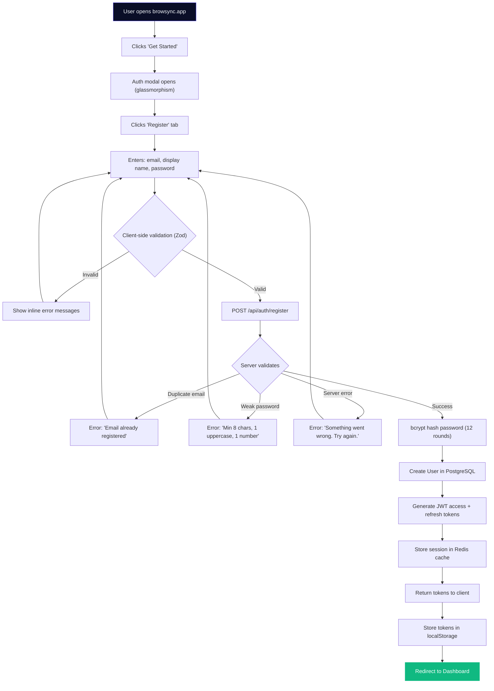
```mermaid
flowchart TD
    A["User opens browsync.app"] --> B["Clicks 'Get Started'"]
    B --> C["Auth modal opens (glassmorphism)"]
    C --> D["Clicks 'Register' tab"]
    D --> E["Enters: email, display name, password"]
    E --> F{"Client-side validation (Zod)"}
    F -->|"Invalid"| G["Show inline error messages"]
    G --> E
    F -->|"Valid"| H["POST /api/auth/register"]
    H --> I{"Server validates"}
    I -->|"Duplicate email"| J["Error: 'Email already registered'"]
    I -->|"Weak password"| K["Error: 'Min 8 chars, 1 uppercase, 1 number'"]
    I -->|"Server error"| L["Error: 'Something went wrong. Try again.'"]
    J --> E
    K --> E
    L --> E
    I -->|"Success"| M["bcrypt hash password (12 rounds)"]
    M --> N["Create User in PostgreSQL"]
    N --> O["Generate JWT access + refresh tokens"]
    O --> P["Store session in Redis cache"]
    P --> Q["Return tokens to client"]
    Q --> R["Store tokens in localStorage"]
    R --> S["Redirect to Dashboard"]

    style A fill:#0a0e27,stroke:#4f46e5,color:#f1f5f9
    style S fill:#10b981,stroke:#10b981,color:#fff
```

### Agent Responsibilities
- 🔧 **Agent A**: Zod `registerSchema` validation
- 🖥️ **Agent B**: POST /api/auth/register endpoint, bcrypt, JWT generation
- 🌐 **Agent C**: AuthModal UI, form validation, token storage

---

## 2. User Login Flow

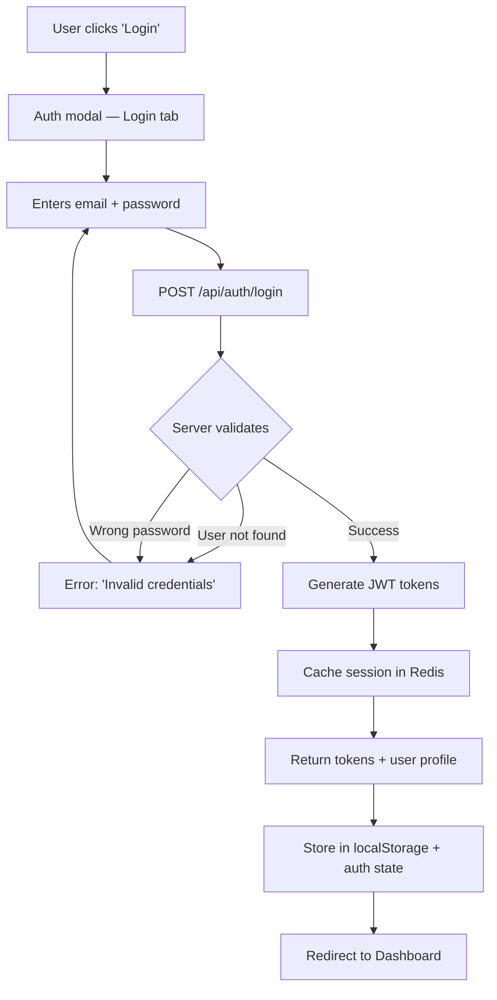
```mermaid
flowchart TD
    A["User clicks 'Login'"] --> B["Auth modal — Login tab"]
    B --> C["Enters email + password"]
    C --> D["POST /api/auth/login"]
    D --> E{"Server validates"}
    E -->|"User not found"| F["Error: 'Invalid credentials'"]
    E -->|"Wrong password"| F
    E -->|"Success"| G["Generate JWT tokens"]
    G --> H["Cache session in Redis"]
    H --> I["Return tokens + user profile"]
    I --> J["Store in localStorage + auth state"]
    J --> K["Redirect to Dashboard"]

    F --> C
```

### Token Refresh Flow
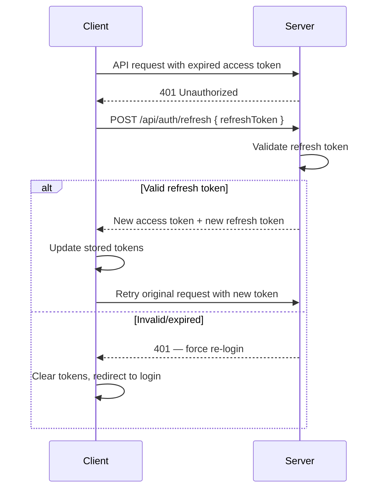
```mermaid
sequenceDiagram
    participant C as Client
    participant S as Server

    C->>S: API request with expired access token
    S-->>C: 401 Unauthorized
    C->>S: POST /api/auth/refresh { refreshToken }
    S->>S: Validate refresh token
    alt Valid refresh token
        S-->>C: New access token + new refresh token
        C->>C: Update stored tokens
        C->>S: Retry original request with new token
    else Invalid/expired
        S-->>C: 401 — force re-login
        C->>C: Clear tokens, redirect to login
    end
```

---

## 3. Room Creation Flow (Host)

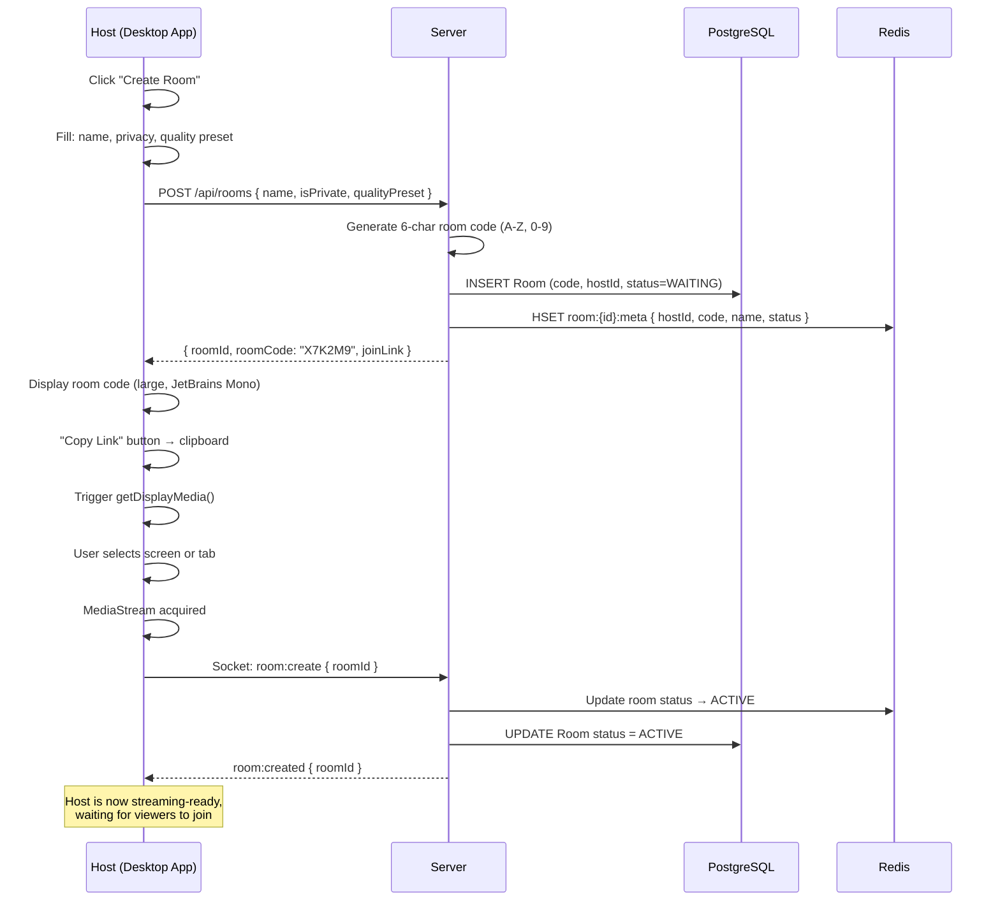
```mermaid
sequenceDiagram
    participant H as Host (Desktop App)
    participant S as Server
    participant DB as PostgreSQL
    participant R as Redis

    H->>H: Click "Create Room"
    H->>H: Fill: name, privacy, quality preset
    H->>S: POST /api/rooms { name, isPrivate, qualityPreset }
    S->>S: Generate 6-char room code (A-Z, 0-9)
    S->>DB: INSERT Room (code, hostId, status=WAITING)
    S->>R: HSET room:{id}:meta { hostId, code, name, status }
    S-->>H: { roomId, roomCode: "X7K2M9", joinLink }

    H->>H: Display room code (large, JetBrains Mono)
    H->>H: "Copy Link" button → clipboard
    
    H->>H: Trigger getDisplayMedia()
    H->>H: User selects screen or tab
    H->>H: MediaStream acquired
    
    H->>S: Socket: room:create { roomId }
    S->>R: Update room status → ACTIVE
    S->>DB: UPDATE Room status = ACTIVE
    S-->>H: room:created { roomId }
    
    Note over H: Host is now streaming-ready,<br/>waiting for viewers to join
```

### Room Code Generation (Agent B)
```typescript
// 6-char uppercase alphanumeric, collision-resistant
function generateRoomCode(): string {
  const chars = 'ABCDEFGHJKLMNPQRSTUVWXYZ23456789'; // No 0/O/1/I confusion
  let code = '';
  for (let i = 0; i < 6; i++) {
    code += chars[crypto.randomInt(chars.length)];
  }
  return code; // e.g., "X7K2M9"
}
```

---

## 4. Room Join Flow (Viewer)

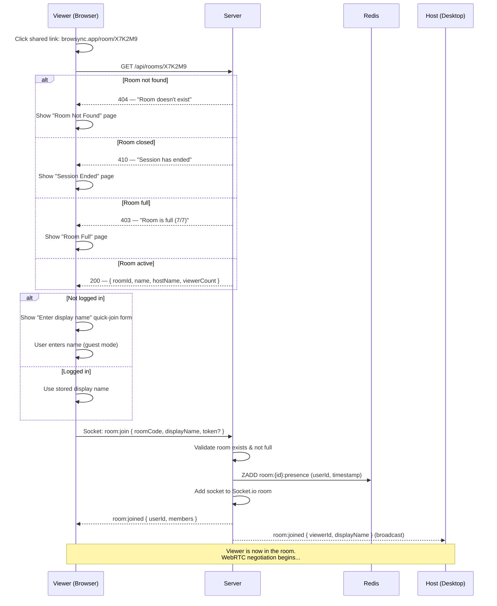
```mermaid
sequenceDiagram
    participant V as Viewer (Browser)
    participant S as Server
    participant R as Redis
    participant H as Host (Desktop)

    V->>V: Click shared link: browsync.app/room/X7K2M9
    V->>S: GET /api/rooms/X7K2M9

    alt Room not found
        S-->>V: 404 — "Room doesn't exist"
        V->>V: Show "Room Not Found" page
    else Room closed
        S-->>V: 410 — "Session has ended"
        V->>V: Show "Session Ended" page
    else Room full
        S-->>V: 403 — "Room is full (7/7)"
        V->>V: Show "Room Full" page
    else Room active
        S-->>V: 200 — { roomId, name, hostName, viewerCount }
    end

    alt Not logged in
        V->>V: Show "Enter display name" quick-join form
        V->>V: User enters name (guest mode)
    else Logged in
        V->>V: Use stored display name
    end

    V->>S: Socket: room:join { roomCode, displayName, token? }
    S->>S: Validate room exists & not full
    S->>R: ZADD room:{id}:presence (userId, timestamp)
    S->>S: Add socket to Socket.io room
    S-->>V: room:joined { userId, members }
    S-->>H: room:joined { viewerId, displayName } (broadcast)
    
    Note over V,H: Viewer is now in the room.<br/>WebRTC negotiation begins...
```

---

## 5. WebRTC Connection Establishment

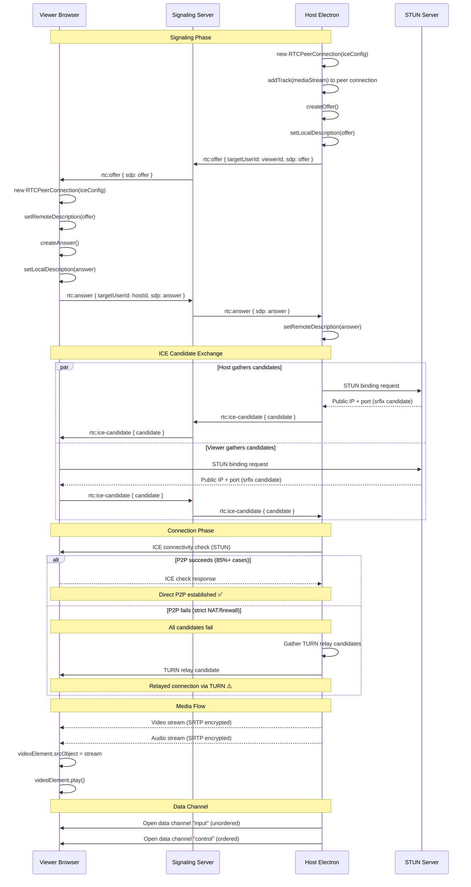
```mermaid
sequenceDiagram
    participant V as Viewer Browser
    participant S as Signaling Server
    participant H as Host Electron
    participant STUN as STUN Server

    Note over V,H: Signaling Phase

    H->>H: new RTCPeerConnection(iceConfig)
    H->>H: addTrack(mediaStream) to peer connection
    H->>H: createOffer()
    H->>H: setLocalDescription(offer)
    H->>S: rtc:offer { targetUserId: viewerId, sdp: offer }
    S->>V: rtc:offer { sdp: offer }

    V->>V: new RTCPeerConnection(iceConfig)
    V->>V: setRemoteDescription(offer)
    V->>V: createAnswer()
    V->>V: setLocalDescription(answer)
    V->>S: rtc:answer { targetUserId: hostId, sdp: answer }
    S->>H: rtc:answer { sdp: answer }
    H->>H: setRemoteDescription(answer)

    Note over V,H: ICE Candidate Exchange

    par Host gathers candidates
        H->>STUN: STUN binding request
        STUN-->>H: Public IP + port (srflx candidate)
        H->>S: rtc:ice-candidate { candidate }
        S->>V: rtc:ice-candidate { candidate }
    and Viewer gathers candidates
        V->>STUN: STUN binding request
        STUN-->>V: Public IP + port (srflx candidate)
        V->>S: rtc:ice-candidate { candidate }
        S->>H: rtc:ice-candidate { candidate }
    end

    Note over V,H: Connection Phase

    H->>V: ICE connectivity check (STUN)
    
    alt P2P succeeds (85%+ cases)
        V-->>H: ICE check response
        Note over V,H: Direct P2P established ✅
    else P2P fails (strict NAT/firewall)
        Note over V,H: All candidates fail
        H->>H: Gather TURN relay candidates
        H->>V: TURN relay candidate
        Note over V,H: Relayed connection via TURN ⚠️
    end

    Note over V,H: Media Flow

    H-->>V: Video stream (SRTP encrypted)
    H-->>V: Audio stream (SRTP encrypted)
    V->>V: videoElement.srcObject = stream
    V->>V: videoElement.play()
    
    Note over V,H: Data Channel

    H->>V: Open data channel "input" (unordered)
    H->>V: Open data channel "control" (ordered)
```

### ICE Connection States
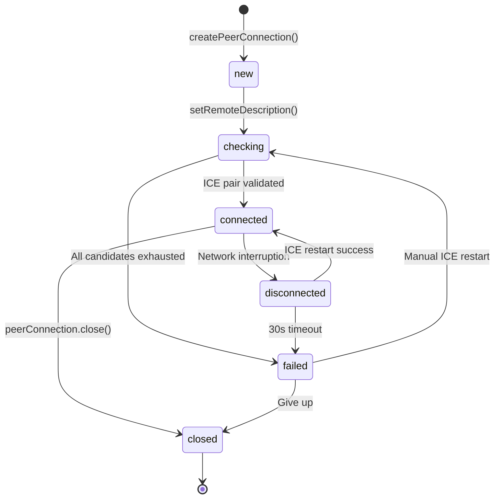
```mermaid
stateDiagram-v2
    [*] --> new: createPeerConnection()
    new --> checking: setRemoteDescription()
    checking --> connected: ICE pair validated
    checking --> failed: All candidates exhausted
    connected --> disconnected: Network interruption
    disconnected --> connected: ICE restart success
    disconnected --> failed: 30s timeout
    failed --> checking: Manual ICE restart
    connected --> closed: peerConnection.close()
    failed --> closed: Give up
    closed --> [*]
```

---

## 6. Control Request Flow

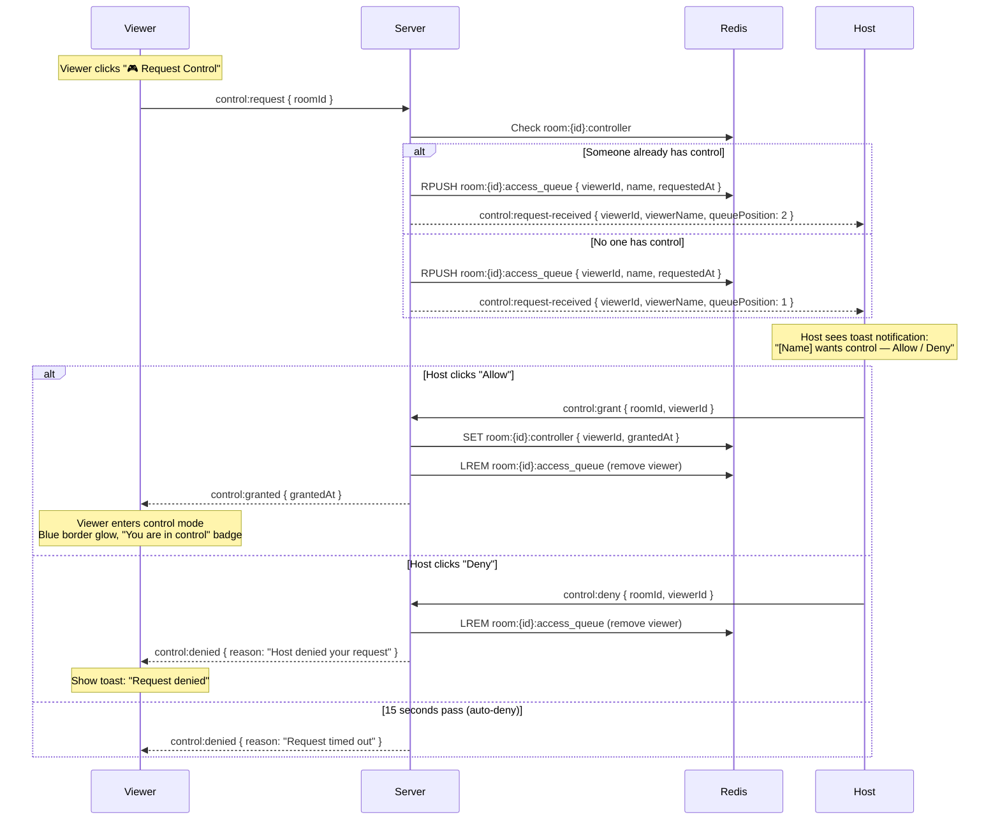
```mermaid
sequenceDiagram
    participant V as Viewer
    participant S as Server
    participant R as Redis
    participant H as Host

    Note over V: Viewer clicks "🎮 Request Control"
    V->>S: control:request { roomId }

    S->>R: Check room:{id}:controller
    alt Someone already has control
        S->>R: RPUSH room:{id}:access_queue { viewerId, name, requestedAt }
        S-->>H: control:request-received { viewerId, viewerName, queuePosition: 2 }
    else No one has control
        S->>R: RPUSH room:{id}:access_queue { viewerId, name, requestedAt }
        S-->>H: control:request-received { viewerId, viewerName, queuePosition: 1 }
    end

    Note over H: Host sees toast notification:<br/>"[Name] wants control — Allow / Deny"

    alt Host clicks "Allow"
        H->>S: control:grant { roomId, viewerId }
        S->>R: SET room:{id}:controller { viewerId, grantedAt }
        S->>R: LREM room:{id}:access_queue (remove viewer)
        S-->>V: control:granted { grantedAt }
        Note over V: Viewer enters control mode<br/>Blue border glow, "You are in control" badge
    else Host clicks "Deny"
        H->>S: control:deny { roomId, viewerId }
        S->>R: LREM room:{id}:access_queue (remove viewer)
        S-->>V: control:denied { reason: "Host denied your request" }
        Note over V: Show toast: "Request denied"
    else 15 seconds pass (auto-deny)
        S-->>V: control:denied { reason: "Request timed out" }
    end
```

### Control Revocation
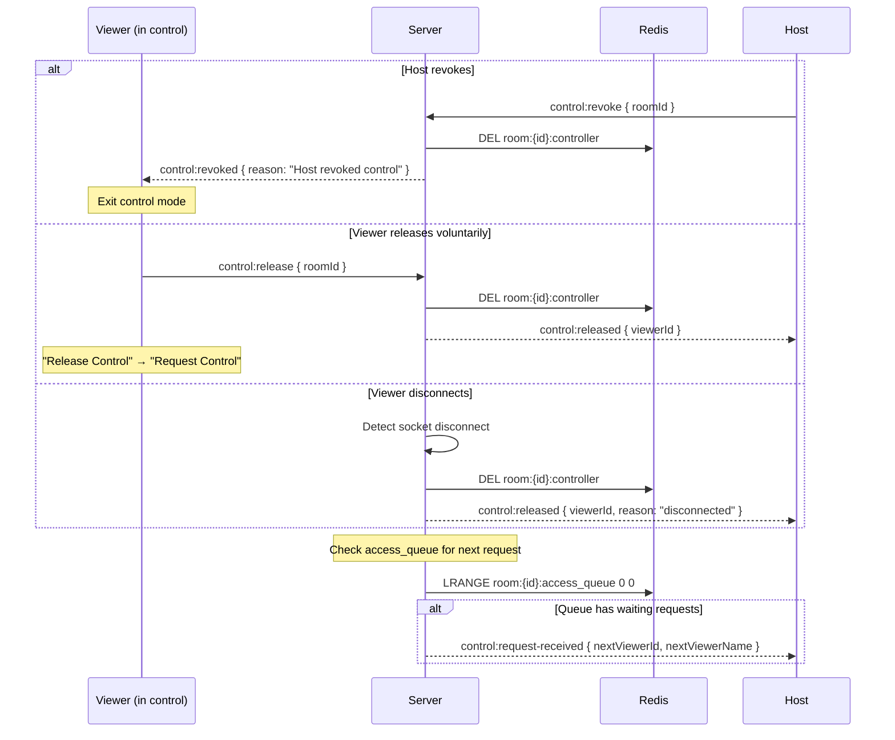
```mermaid
sequenceDiagram
    participant V as Viewer (in control)
    participant S as Server
    participant R as Redis
    participant H as Host

    alt Host revokes
        H->>S: control:revoke { roomId }
        S->>R: DEL room:{id}:controller
        S-->>V: control:revoked { reason: "Host revoked control" }
        Note over V: Exit control mode
    else Viewer releases voluntarily
        V->>S: control:release { roomId }
        S->>R: DEL room:{id}:controller
        S-->>H: control:released { viewerId }
        Note over V: "Release Control" → "Request Control"
    else Viewer disconnects
        S->>S: Detect socket disconnect
        S->>R: DEL room:{id}:controller
        S-->>H: control:released { viewerId, reason: "disconnected" }
    end

    Note over S: Check access_queue for next request
    S->>R: LRANGE room:{id}:access_queue 0 0
    alt Queue has waiting requests
        S-->>H: control:request-received { nextViewerId, nextViewerName }
    end
```

---

## 7. Input Injection Flow

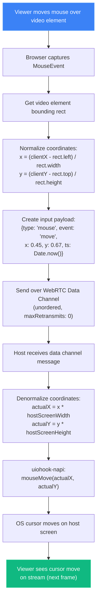
```mermaid
flowchart TD
    A["Viewer moves mouse over video element"] --> B["Browser captures MouseEvent"]
    B --> C["Get video element bounding rect"]
    C --> D["Normalize coordinates:<br/>x = (clientX - rect.left) / rect.width<br/>y = (clientY - rect.top) / rect.height"]
    D --> E["Create input payload:<br/>{type: 'mouse', event: 'move',<br/>x: 0.45, y: 0.67, ts: Date.now()}"]
    E --> F["Send over WebRTC Data Channel<br/>(unordered, maxRetransmits: 0)"]
    F --> G["Host receives data channel message"]
    G --> H["Denormalize coordinates:<br/>actualX = x * hostScreenWidth<br/>actualY = y * hostScreenHeight"]
    H --> I["uiohook-napi:<br/>mouseMove(actualX, actualY)"]
    I --> J["OS cursor moves on host screen"]
    J --> K["Viewer sees cursor move<br/>on stream (next frame)"]

    style A fill:#3b82f6,stroke:#60a5fa,color:#fff
    style K fill:#10b981,stroke:#34d399,color:#fff
```

### Supported Input Events

| Event Type | Viewer Capture | Data Channel Payload | Host Injection |
|-----------|---------------|---------------------|----------------|
| Mouse move | `mousemove` | `{type:'mouse', event:'move', x, y}` | `uiohook.mouseMove(x, y)` |
| Left click | `mousedown` + `mouseup` | `{type:'mouse', event:'click', button:'left', x, y}` | `uiohook.mouseClick(x, y, 'left')` |
| Right click | `contextmenu` | `{type:'mouse', event:'click', button:'right', x, y}` | `uiohook.mouseClick(x, y, 'right')` |
| Scroll | `wheel` | `{type:'mouse', event:'scroll', deltaX, deltaY}` | `uiohook.mouseScroll(deltaX, deltaY)` |
| Key press | `keydown` | `{type:'keyboard', event:'keydown', keyCode, key}` | `uiohook.keyDown(keyCode)` |
| Key release | `keyup` | `{type:'keyboard', event:'keyup', keyCode, key}` | `uiohook.keyUp(keyCode)` |

### Agent Responsibilities
- 🌐 **Agent C**: Capture mouse/keyboard events, normalize coordinates, send via data channel
- 💻 **Agent D**: Receive data channel messages, denormalize, inject via uiohook-napi
- 🔧 **Agent A**: `InputEvent`, `MouseInput`, `KeyboardInput` type definitions

---

## 8. Chat Flow

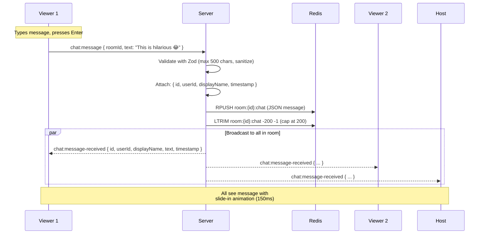
```mermaid
sequenceDiagram
    participant V1 as Viewer 1
    participant S as Server
    participant R as Redis
    participant V2 as Viewer 2
    participant H as Host

    Note over V1: Types message, presses Enter
    V1->>S: chat:message { roomId, text: "This is hilarious 😂" }
    S->>S: Validate with Zod (max 500 chars, sanitize)
    S->>S: Attach: { id, userId, displayName, timestamp }
    S->>R: RPUSH room:{id}:chat (JSON message)
    S->>R: LTRIM room:{id}:chat -200 -1 (cap at 200)
    
    par Broadcast to all in room
        S-->>V1: chat:message-received { id, userId, displayName, text, timestamp }
        S-->>V2: chat:message-received { ... }
        S-->>H: chat:message-received { ... }
    end

    Note over V1,H: All see message with<br/>slide-in animation (150ms)
```

### Chat History on Join
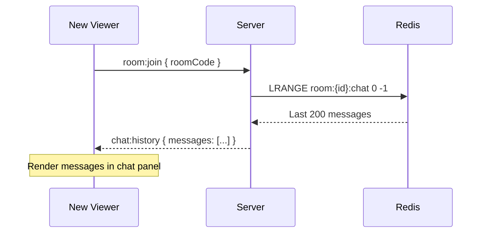
```mermaid
sequenceDiagram
    participant V as New Viewer
    participant S as Server
    participant R as Redis

    V->>S: room:join { roomCode }
    S->>R: LRANGE room:{id}:chat 0 -1
    R-->>S: Last 200 messages
    S-->>V: chat:history { messages: [...] }
    Note over V: Render messages in chat panel
```

---

## 9. Emoji Reaction Flow

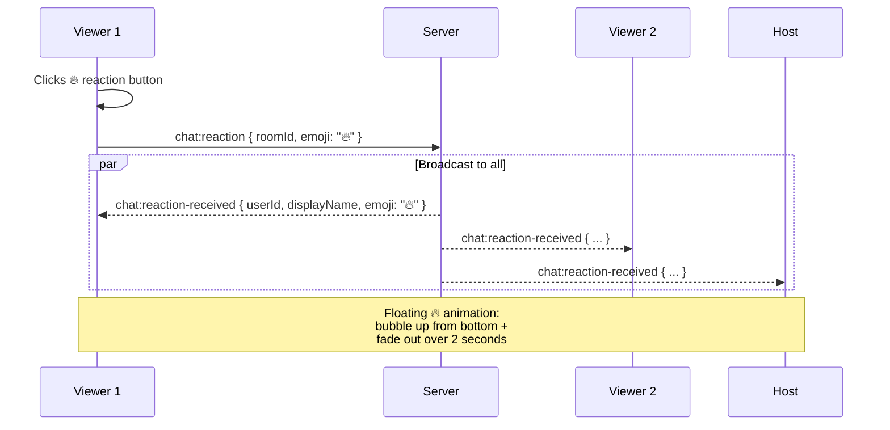
```mermaid
sequenceDiagram
    participant V1 as Viewer 1
    participant S as Server
    participant V2 as Viewer 2
    participant H as Host

    V1->>V1: Clicks 🔥 reaction button
    V1->>S: chat:reaction { roomId, emoji: "🔥" }
    
    par Broadcast to all
        S-->>V1: chat:reaction-received { userId, displayName, emoji: "🔥" }
        S-->>V2: chat:reaction-received { ... }
        S-->>H: chat:reaction-received { ... }
    end

    Note over V1,H: Floating 🔥 animation:<br/>bubble up from bottom +<br/>fade out over 2 seconds
```

> [!NOTE]
> Reactions are **ephemeral** — they are NOT stored in Redis or PostgreSQL. They exist only as transient Socket.io broadcasts.

---

## 10. Disconnect & Reconnection Flow

### Viewer Disconnects
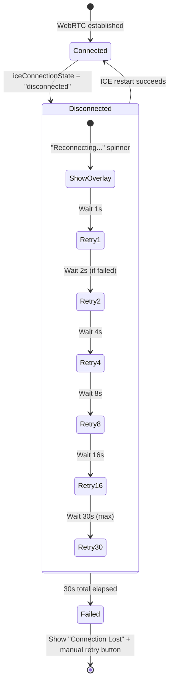
```mermaid
stateDiagram-v2
    [*] --> Connected: WebRTC established
    Connected --> Disconnected: iceConnectionState = "disconnected"
    
    state Disconnected {
        [*] --> ShowOverlay: "Reconnecting..." spinner
        ShowOverlay --> Retry1: Wait 1s
        Retry1 --> Retry2: Wait 2s (if failed)
        Retry2 --> Retry4: Wait 4s
        Retry4 --> Retry8: Wait 8s
        Retry8 --> Retry16: Wait 16s
        Retry16 --> Retry30: Wait 30s (max)
    }
    
    Disconnected --> Connected: ICE restart succeeds
    Disconnected --> Failed: 30s total elapsed
    Failed --> [*]: Show "Connection Lost" + manual retry button
```

### Host Disconnects
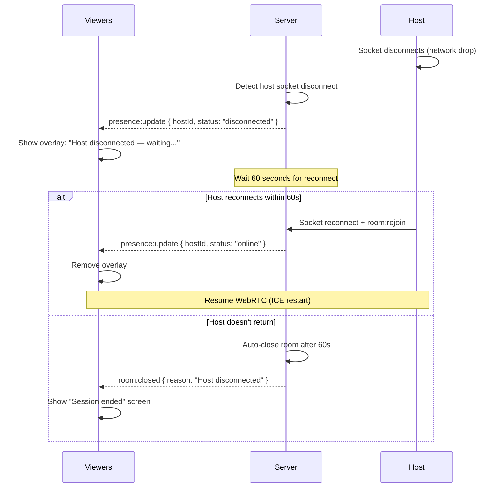
```mermaid
sequenceDiagram
    participant V as Viewers
    participant S as Server
    participant H as Host

    H->>H: Socket disconnects (network drop)
    S->>S: Detect host socket disconnect
    S-->>V: presence:update { hostId, status: "disconnected" }
    V->>V: Show overlay: "Host disconnected — waiting..."
    
    Note over S: Wait 60 seconds for reconnect
    
    alt Host reconnects within 60s
        H->>S: Socket reconnect + room:rejoin
        S-->>V: presence:update { hostId, status: "online" }
        V->>V: Remove overlay
        Note over V,H: Resume WebRTC (ICE restart)
    else Host doesn't return
        S->>S: Auto-close room after 60s
        S-->>V: room:closed { reason: "Host disconnected" }
        V->>V: Show "Session ended" screen
    end
```

---

## 11. Room Closure Flow

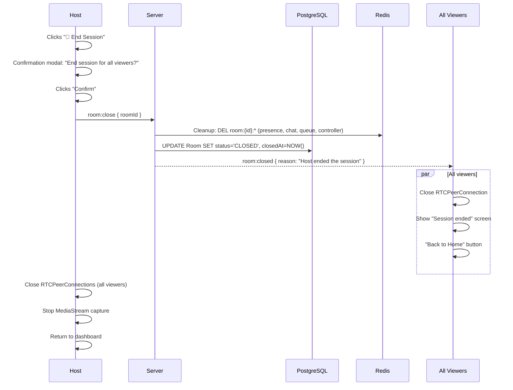
```mermaid
sequenceDiagram
    participant H as Host
    participant S as Server
    participant DB as PostgreSQL
    participant R as Redis
    participant V as All Viewers

    H->>H: Clicks "🔴 End Session"
    H->>H: Confirmation modal: "End session for all viewers?"
    H->>H: Clicks "Confirm"
    
    H->>S: room:close { roomId }
    S->>R: Cleanup: DEL room:{id}:* (presence, chat, queue, controller)
    S->>DB: UPDATE Room SET status='CLOSED', closedAt=NOW()
    
    S-->>V: room:closed { reason: "Host ended the session" }
    
    par All viewers
        V->>V: Close RTCPeerConnection
        V->>V: Show "Session ended" screen
        V->>V: "Back to Home" button
    end
    
    H->>H: Close RTCPeerConnections (all viewers)
    H->>H: Stop MediaStream capture
    H->>H: Return to dashboard
```

---

## 12. Adaptive Bitrate Flow

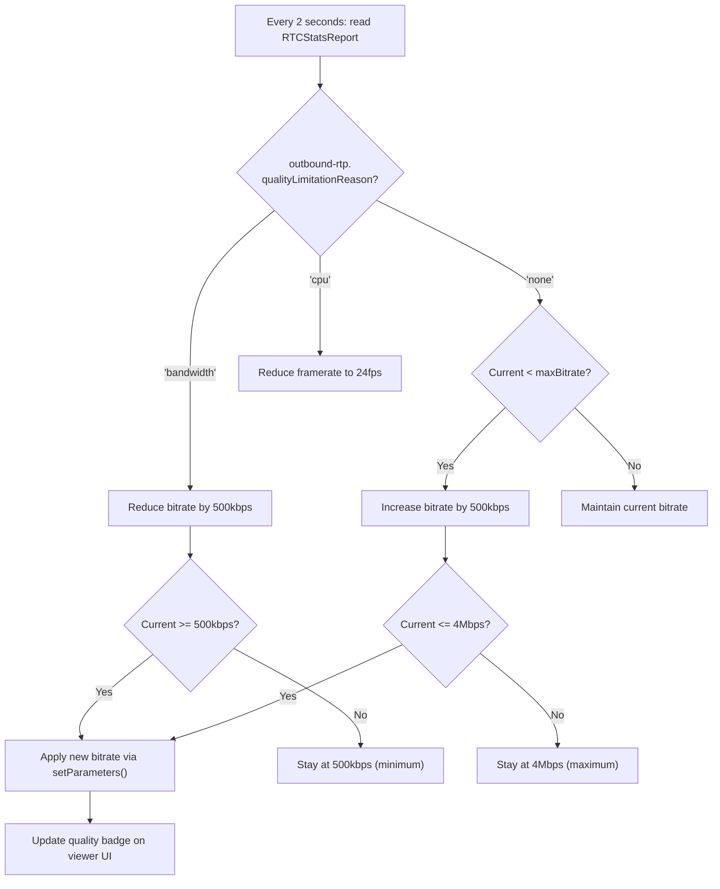
```mermaid
flowchart TD
    A["Every 2 seconds: read RTCStatsReport"] --> B{"outbound-rtp.<br/>qualityLimitationReason?"}
    
    B -->|"'bandwidth'"| C["Reduce bitrate by 500kbps"]
    C --> D{"Current >= 500kbps?"}
    D -->|"Yes"| E["Apply new bitrate via setParameters()"]
    D -->|"No"| F["Stay at 500kbps (minimum)"]
    
    B -->|"'none'"| G{"Current < maxBitrate?"}
    G -->|"Yes"| H["Increase bitrate by 500kbps"]
    H --> I{"Current <= 4Mbps?"}
    I -->|"Yes"| E
    I -->|"No"| J["Stay at 4Mbps (maximum)"]
    G -->|"No"| K["Maintain current bitrate"]
    
    B -->|"'cpu'"| L["Reduce framerate to 24fps"]
    
    E --> M["Update quality badge on viewer UI"]
```

### Resolution Tiers

| Bitrate | Resolution | FPS | Quality Badge |
|---------|-----------|-----|---------------|
| 3.0–4.0 Mbps | 1080p | 30–60 | 🟢 HD |
| 1.5–3.0 Mbps | 720p | 30 | 🟢 Good |
| 750k–1.5 Mbps | 480p | 30 | 🟡 Medium |
| 500–750 kbps | 360p | 24 | 🔴 Low |

---

## 13. Guest vs Registered User Flow

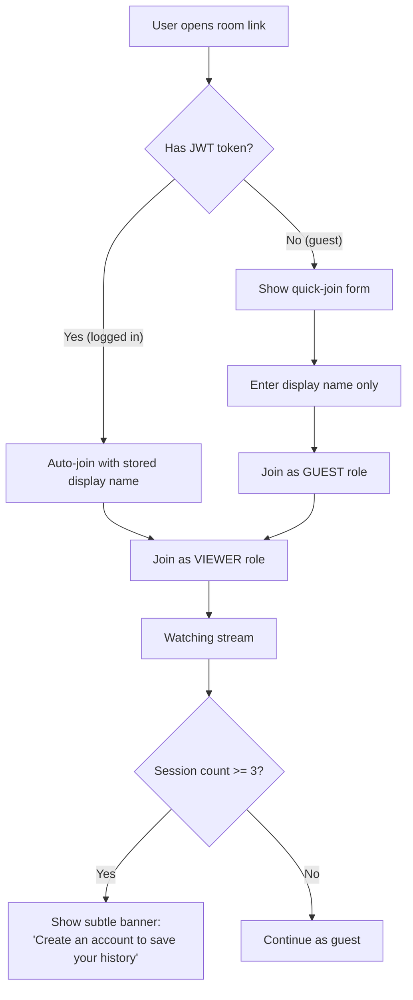
```mermaid
flowchart TD
    A["User opens room link"] --> B{"Has JWT token?"}
    B -->|"Yes (logged in)"| C["Auto-join with stored display name"]
    B -->|"No (guest)"| D["Show quick-join form"]
    D --> E["Enter display name only"]
    E --> F["Join as GUEST role"]
    
    C --> G["Join as VIEWER role"]
    F --> G
    G --> H["Watching stream"]
    
    H --> I{"Session count >= 3?"}
    I -->|"Yes"| J["Show subtle banner:<br/>'Create an account to save your history'"]
    I -->|"No"| K["Continue as guest"]
```

| Capability | Guest | Registered |
|-----------|-------|------------|
| View stream | ✅ | ✅ |
| Chat | ✅ | ✅ |
| React with emoji | ✅ | ✅ |
| Request control | ✅ | ✅ |
| Create/host rooms | ❌ | ✅ |
| Room history | ❌ | ✅ |
| Saved preferences | ❌ | ✅ |

---

## 14. Error Recovery Flows

| Error | Detection | User Sees | Recovery |
|-------|-----------|-----------|----------|
| `getDisplayMedia` permission denied | `NotAllowedError` | "Screen capture permission required" + retry button | User grants permission manually |
| WebRTC negotiation failure | `RTCPeerConnection.onfailed` | "Unable to connect — retrying..." | Auto ICE restart; manual retry after 30s |
| Signaling server unreachable | Socket.io `connect_error` | "Server connection lost — retrying..." | Exponential backoff (1s, 2s, 4s...) |
| Room code invalid | 404 from GET /api/rooms/:code | "Room not found" page | "Go Home" button |
| Token expired mid-session | 401 on any request | Transparent refresh | Auto-refresh via refresh token; re-login if failed |
| Browser tab closed (host) | Socket disconnect | Viewers: "Host disconnected" overlay | 60s auto-wait; auto-close if no reconnect |
| WebRTC stream black (DRM) | No visual check possible | User sees black stream | Toast: "This content may be DRM-protected" |

---

## Appendix: Complete Flow Summary

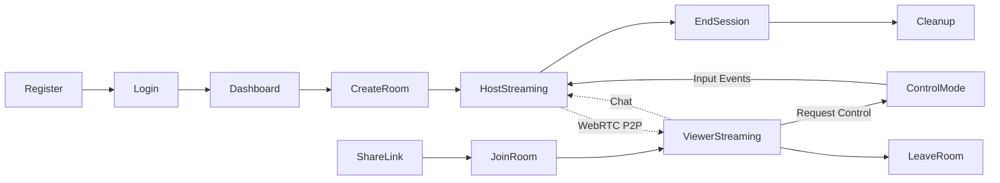
```mermaid
flowchart LR
    Register --> Login --> Dashboard --> CreateRoom --> HostStreaming
    
    ShareLink --> JoinRoom --> ViewerStreaming
    
    HostStreaming -.->|"WebRTC P2P"| ViewerStreaming
    ViewerStreaming -.->|"Chat"| HostStreaming
    ViewerStreaming -->|"Request Control"| ControlMode
    ControlMode -->|"Input Events"| HostStreaming
    
    HostStreaming --> EndSession --> Cleanup
    ViewerStreaming --> LeaveRoom
```
