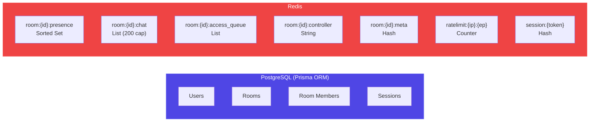
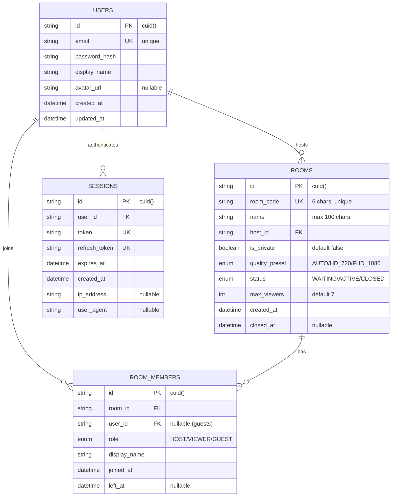

# BrowSync — Backend Schema Document

> **Version**: 1.0 · **Last Updated**: 2026-06-01 · **Status**: Draft
> **Built by**: 🧠 Orchestrator Agent · **Primary Agent**: 🖥️ Agent B (Server), 🔧 Agent A (Shared schemas)

---

## 1. Database Architecture Overview

### Dual-Database Strategy

| Database | Role | Data | Consistency |
|----------|------|------|-------------|
| **PostgreSQL 16** | Persistent store | Users, rooms, sessions | Strong (ACID) |
| **Redis 7** | Ephemeral real-time | Presence, chat, control queue | Eventual |



### Data Flow

| Data Type | Source | Written To | Read By | Lifecycle |
|-----------|--------|-----------|---------|-----------|
| User profiles | Registration | PostgreSQL | Server auth, API | Permanent |
| Room records | Room creation | PostgreSQL + Redis | Server, viewers | Permanent (PG), TTL (Redis) |
| Presence | Heartbeats | Redis | All connected users | Room lifetime + 5min |
| Chat messages | User messages | Redis | All in room | Room lifetime + 1hr |
| Control state | Grant/revoke | Redis | Host + controller | Room lifetime |
| Session tokens | Login | PostgreSQL + Redis | Auth middleware | 24h (access), 7d (refresh) |

---

## 2. PostgreSQL Schema (Prisma ORM) — 🖥️ Agent B

### Complete Prisma Schema

```prisma
// ================================================================
// BrowSync Database Schema
// Agent: 🖥️ Agent B (Server)
// Database: PostgreSQL 16
// ORM: Prisma 5.x
// ================================================================

generator client {
  provider = "prisma-client-js"
}

datasource db {
  provider = "postgresql"
  url      = env("DATABASE_URL")
}

// ── Enums ────────────────────────────────────────────────────────

enum QualityPreset {
  AUTO
  HD_720
  FHD_1080
}

enum RoomStatus {
  WAITING    // Room created, host not yet streaming
  ACTIVE     // Host is streaming
  CLOSED     // Session ended
}

enum MemberRole {
  HOST
  VIEWER
  GUEST
}

// ── Models ───────────────────────────────────────────────────────

/// User account — registered users who can host rooms
model User {
  id           String   @id @default(cuid())
  email        String   @unique
  passwordHash String   @map("password_hash")
  displayName  String   @map("display_name")
  avatarUrl    String?  @map("avatar_url")
  createdAt    DateTime @default(now()) @map("created_at")
  updatedAt    DateTime @updatedAt @map("updated_at")

  // Relations
  hostedRooms  Room[]       @relation("HostedRooms")
  memberships  RoomMember[]
  sessions     Session[]

  @@map("users")
}

/// Room — a streaming session created by a host
model Room {
  id            String        @id @default(cuid())
  roomCode      String        @unique @map("room_code") @db.VarChar(6)
  name          String        @db.VarChar(100)
  hostId        String        @map("host_id")
  isPrivate     Boolean       @default(false) @map("is_private")
  qualityPreset QualityPreset @default(AUTO) @map("quality_preset")
  status        RoomStatus    @default(WAITING)
  maxViewers    Int           @default(7) @map("max_viewers")
  createdAt     DateTime      @default(now()) @map("created_at")
  closedAt      DateTime?     @map("closed_at")

  // Relations
  host    User         @relation("HostedRooms", fields: [hostId], references: [id])
  members RoomMember[]

  // Indexes
  @@index([hostId])
  @@index([status])
  @@index([createdAt])
  @@map("rooms")
}

/// RoomMember — tracks who joined which room
model RoomMember {
  id          String     @id @default(cuid())
  roomId      String     @map("room_id")
  userId      String?    @map("user_id")    // null for guests
  role        MemberRole
  displayName String     @map("display_name")
  joinedAt    DateTime   @default(now()) @map("joined_at")
  leftAt      DateTime?  @map("left_at")

  // Relations
  room Room  @relation(fields: [roomId], references: [id], onDelete: Cascade)
  user User? @relation(fields: [userId], references: [id])

  // Unique: one user per room (except guests who have null userId)
  @@unique([roomId, userId])
  @@index([roomId])
  @@index([userId])
  @@map("room_members")
}

/// Session — JWT session tracking for token revocation
model Session {
  id           String   @id @default(cuid())
  userId       String   @map("user_id")
  token        String   @unique
  refreshToken String   @unique @map("refresh_token")
  expiresAt    DateTime @map("expires_at")
  createdAt    DateTime @default(now()) @map("created_at")
  ipAddress    String?  @map("ip_address")
  userAgent    String?  @map("user_agent")

  // Relations
  user User @relation(fields: [userId], references: [id], onDelete: Cascade)

  @@index([userId])
  @@map("sessions")
}
```

### Entity Relationship Diagram



---

## 3. Redis Data Structures — 🖥️ Agent B

### 3.1 Room Presence

| Property | Value |
|----------|-------|
| **Key** | `room:{roomId}:presence` |
| **Type** | Sorted Set |
| **Score** | Unix timestamp (last heartbeat) |
| **Member** | JSON: `{"userId":"abc","displayName":"Arjun","role":"VIEWER"}` |
| **TTL** | Room lifetime + 5 minutes |

**Operations:**
```redis
ZADD room:abc123:presence 1717200000 '{"userId":"u1","displayName":"Arjun","role":"VIEWER"}'
ZRANGEBYSCORE room:abc123:presence -inf +inf          -- Get all members
ZCARD room:abc123:presence                             -- Count members
ZREM room:abc123:presence '{"userId":"u1",...}'         -- Remove on leave
ZRANGEBYSCORE room:abc123:presence (NOW-60) +inf       -- Active users only
```

**Heartbeat**: Clients send `presence:heartbeat` every 30 seconds. Users with score > 60 seconds old are considered offline.

---

### 3.2 Chat Messages

| Property | Value |
|----------|-------|
| **Key** | `room:{roomId}:chat` |
| **Type** | List |
| **Value** | JSON: `{"id":"msg_1","userId":"u1","displayName":"Arjun","text":"Hello!","timestamp":1717200000,"type":"message"}` |
| **Max Length** | 200 messages |
| **TTL** | Room lifetime + 1 hour |

**Operations:**
```redis
RPUSH room:abc123:chat '{"id":"msg_1","userId":"u1","displayName":"Arjun","text":"Hello!","timestamp":1717200000,"type":"message"}'
LTRIM room:abc123:chat -200 -1                         -- Cap at 200
LRANGE room:abc123:chat 0 -1                           -- Get all history
```

**Message types:**
- `"message"` — user chat message
- `"system"` — system message ("Arjun joined", "Priya left")

---

### 3.3 Access Queue

| Property | Value |
|----------|-------|
| **Key** | `room:{roomId}:access_queue` |
| **Type** | List |
| **Value** | JSON: `{"userId":"u2","displayName":"Priya","requestedAt":1717200000}` |
| **TTL** | Room lifetime |

**Operations:**
```redis
RPUSH room:abc123:access_queue '{"userId":"u2","displayName":"Priya","requestedAt":1717200000}'
LPOP room:abc123:access_queue                          -- Process next in queue
LREM room:abc123:access_queue 1 '...'                  -- Cancel specific request
LRANGE room:abc123:access_queue 0 -1                   -- View full queue
LLEN room:abc123:access_queue                          -- Queue length
```

---

### 3.4 Current Controller

| Property | Value |
|----------|-------|
| **Key** | `room:{roomId}:controller` |
| **Type** | String |
| **Value** | JSON: `{"userId":"u2","displayName":"Priya","grantedAt":1717200000}` or `""` (empty) |
| **TTL** | Room lifetime |

**Operations:**
```redis
SET room:abc123:controller '{"userId":"u2","displayName":"Priya","grantedAt":1717200000}'
GET room:abc123:controller                             -- Check who has control
DEL room:abc123:controller                             -- Revoke control
```

---

### 3.5 Room Metadata Cache

| Property | Value |
|----------|-------|
| **Key** | `room:{roomId}:meta` |
| **Type** | Hash |
| **Fields** | `hostId`, `roomCode`, `name`, `status`, `quality`, `createdAt` |
| **TTL** | Room lifetime + 5 minutes |

**Operations:**
```redis
HSET room:abc123:meta hostId "u1" roomCode "X7K2M9" name "Movie Night" status "ACTIVE" quality "AUTO"
HGETALL room:abc123:meta                               -- Get all fields
HSET room:abc123:meta status "CLOSED"                  -- Update status
```

---

### 3.6 Rate Limiting

| Property | Value |
|----------|-------|
| **Key** | `ratelimit:{ip}:{endpoint}` |
| **Type** | String (counter) |
| **Value** | Request count (integer) |
| **TTL** | 60 seconds |

**Operations:**
```redis
INCR ratelimit:192.168.1.1:auth/login                  -- Increment counter
EXPIRE ratelimit:192.168.1.1:auth/login 60             -- Set 60s window
GET ratelimit:192.168.1.1:auth/login                   -- Check count
```

---

### 3.7 Session Cache

| Property | Value |
|----------|-------|
| **Key** | `session:{jwtToken}` |
| **Type** | Hash |
| **Fields** | `userId`, `displayName`, `email`, `createdAt` |
| **TTL** | 24 hours (matches JWT access token expiry) |

**Operations:**
```redis
HSET session:eyJhbG... userId "u1" displayName "Arjun" email "arjun@example.com"
HGETALL session:eyJhbG...                              -- Fast session lookup
DEL session:eyJhbG...                                  -- Logout
```

---

## 4. REST API Schema — 🖥️ Agent B

### Auth Endpoints

#### POST /api/auth/register
```typescript
// Request
{
  email: string;        // "arjun@example.com" — valid email, unique
  displayName: string;  // "Arjun" — 2-50 chars
  password: string;     // "MyP@ss123" — min 8 chars, 1 uppercase, 1 number
}

// Success Response (201)
{
  user: { id, email, displayName, createdAt },
  accessToken: string,   // JWT, 24h expiry
  refreshToken: string,  // JWT, 7d expiry
}

// Error Responses
// 400 — Validation error (details in body)
// 409 — Email already registered
// 500 — Internal server error
```

#### POST /api/auth/login
```typescript
// Request
{ email: string; password: string; }

// Success Response (200)
{ user: { id, email, displayName, avatarUrl }, accessToken, refreshToken }

// Errors: 400 (validation), 401 (invalid credentials), 500
```

#### POST /api/auth/refresh
```typescript
// Request
{ refreshToken: string; }

// Success Response (200)
{ accessToken: string; refreshToken: string; } // New pair (rotation)

// Errors: 401 (invalid/expired refresh token)
```

#### POST /api/auth/logout
```typescript
// Headers: Authorization: Bearer <accessToken>
// Response: 200 { message: "Logged out" }
// Side effects: Delete session from PG + Redis
```

#### GET /api/auth/me
```typescript
// Headers: Authorization: Bearer <accessToken>
// Response (200)
{ id, email, displayName, avatarUrl, createdAt }
```

---

### Room Endpoints

#### POST /api/rooms
```typescript
// Headers: Authorization: Bearer <accessToken>
// Request
{
  name: string;            // "Movie Night 🍿" — 1-100 chars
  isPrivate?: boolean;     // default false
  qualityPreset?: "AUTO" | "HD_720" | "FHD_1080"; // default AUTO
}

// Success Response (201)
{
  id: string;
  roomCode: string;        // "X7K2M9"
  name: string;
  joinLink: string;        // "https://browsync.app/room/X7K2M9"
  status: "WAITING";
  createdAt: string;
}
```

#### GET /api/rooms/:code
```typescript
// No auth required (public room lookup)
// Response (200)
{
  id: string;
  roomCode: string;
  name: string;
  hostName: string;        // Host's display name
  status: "WAITING" | "ACTIVE";
  viewerCount: number;
  maxViewers: number;
}

// Errors: 404 (not found), 410 (closed)
```

#### GET /api/rooms/my/history
```typescript
// Headers: Authorization: Bearer <accessToken>
// Query: ?page=1&limit=10
// Response (200)
{
  rooms: [{
    id, roomCode, name, status, viewerCount,
    createdAt, closedAt, duration // in seconds
  }],
  total: number;
  page: number;
}
```

#### PATCH /api/rooms/:id/close
```typescript
// Headers: Authorization: Bearer <accessToken>
// Response (200)
{ id, status: "CLOSED", closedAt: string }
// Only the host can close their room
```

---

### Standardized Error Response
```typescript
// All errors follow this format:
{
  error: {
    code: string;      // "VALIDATION_ERROR", "UNAUTHORIZED", "NOT_FOUND", etc.
    message: string;   // Human-readable message
    details?: any;     // Validation errors, field-specific issues
  }
}
```

---

## 5. WebSocket Event Schema — 🖥️ Agent B, 🔧 Agent A

> See [04_App_Flow_Document.md](file:///c:/Users/Lenovo/Downloads/SEAMLESS/browsync/docs/04_App_Flow_Document.md) for detailed flow diagrams of each event.

### Complete Event Catalog

| Event | Direction | Payload Type | Agent |
|-------|-----------|-------------|-------|
| `room:create` | C→S | `{ name, isPrivate, qualityPreset }` | B |
| `room:created` | S→C | `{ roomId, roomCode, joinLink }` | B |
| `room:join` | C→S | `{ roomCode, displayName, token? }` | B |
| `room:joined` | S→C broadcast | `{ userId, displayName, role, viewerCount }` | B |
| `room:leave` | C→S | `{ roomId }` | B |
| `room:left` | S→C broadcast | `{ userId, displayName, viewerCount }` | B |
| `room:close` | C→S | `{ roomId }` | B |
| `room:closed` | S→C broadcast | `{ roomId, reason }` | B |
| `room:error` | S→C | `{ code, message }` | B |
| `rtc:offer` | C→S→C | `{ targetUserId, sdp }` | B |
| `rtc:answer` | C→S→C | `{ targetUserId, sdp }` | B |
| `rtc:ice-candidate` | C→S→C | `{ targetUserId, candidate }` | B |
| `control:request` | C→S | `{ roomId }` | B |
| `control:request-received` | S→C (host) | `{ viewerId, viewerName, queuePosition }` | B |
| `control:grant` | C→S | `{ roomId, viewerId }` | B |
| `control:granted` | S→C (viewer) | `{ grantedAt }` | B |
| `control:deny` | C→S | `{ roomId, viewerId }` | B |
| `control:denied` | S→C (viewer) | `{ reason }` | B |
| `control:revoke` | C→S | `{ roomId }` | B |
| `control:revoked` | S→C (viewer) | `{ reason }` | B |
| `control:release` | C→S | `{ roomId }` | B |
| `control:released` | S→C broadcast | `{ viewerId }` | B |
| `chat:message` | C→S | `{ roomId, text }` | B |
| `chat:message-received` | S→C broadcast | `{ id, userId, displayName, text, timestamp }` | B |
| `chat:reaction` | C→S | `{ roomId, emoji }` | B |
| `chat:reaction-received` | S→C broadcast | `{ userId, displayName, emoji }` | B |
| `chat:history` | S→C | `{ messages: ChatMessage[] }` | B |
| `presence:heartbeat` | C→S | `{ roomId }` | B |
| `presence:update` | S→C broadcast | `{ userId, status, lastSeen }` | B |
| `presence:sync` | S→C | `{ members: PresenceMember[] }` | B |

---

## 6. Data Validation Schemas (Zod) — 🔧 Agent A

```typescript
// ================================================================
// Agent: 🔧 Agent A (Shared Package)
// File: packages/shared/src/schemas/auth.schema.ts
// ================================================================

import { z } from 'zod';

export const registerSchema = z.object({
  email: z.string().email('Invalid email address'),
  displayName: z.string().min(2, 'Min 2 characters').max(50, 'Max 50 characters'),
  password: z.string()
    .min(8, 'Min 8 characters')
    .regex(/[A-Z]/, 'Must contain at least 1 uppercase letter')
    .regex(/[0-9]/, 'Must contain at least 1 number'),
});

export const loginSchema = z.object({
  email: z.string().email(),
  password: z.string().min(1, 'Password required'),
});

// ================================================================
// File: packages/shared/src/schemas/room.schema.ts
// ================================================================

export const roomCreateSchema = z.object({
  name: z.string().min(1, 'Room name required').max(100, 'Max 100 characters'),
  isPrivate: z.boolean().optional().default(false),
  qualityPreset: z.enum(['AUTO', 'HD_720', 'FHD_1080']).optional().default('AUTO'),
});

export const roomJoinSchema = z.object({
  roomCode: z.string().length(6, 'Room code must be 6 characters').toUpperCase(),
  displayName: z.string().min(1).max(50),
});

// ================================================================
// File: packages/shared/src/schemas/chat.schema.ts
// ================================================================

export const chatMessageSchema = z.object({
  roomId: z.string().cuid(),
  text: z.string().min(1, 'Message cannot be empty').max(500, 'Max 500 characters'),
});

export const chatReactionSchema = z.object({
  roomId: z.string().cuid(),
  emoji: z.enum(['👍', '😂', '🔥', '❤️', '😮']),
});

// ================================================================
// File: packages/shared/src/schemas/control.schema.ts
// ================================================================

export const controlRequestSchema = z.object({
  roomId: z.string().cuid(),
});

export const controlGrantSchema = z.object({
  roomId: z.string().cuid(),
  viewerId: z.string(),
});
```

---

## 7. Redis Key Builders — 🖥️ Agent B

```typescript
// ================================================================
// Agent: 🖥️ Agent B (Server)
// File: packages/server/src/utils/redis-keys.ts
// ================================================================

export const RedisKeys = {
  roomPresence:    (roomId: string) => `room:${roomId}:presence`,
  roomChat:        (roomId: string) => `room:${roomId}:chat`,
  roomAccessQueue: (roomId: string) => `room:${roomId}:access_queue`,
  roomController:  (roomId: string) => `room:${roomId}:controller`,
  roomMeta:        (roomId: string) => `room:${roomId}:meta`,
  rateLimit:       (ip: string, endpoint: string) => `ratelimit:${ip}:${endpoint}`,
  session:         (token: string) => `session:${token}`,
} as const;
```

---

## 8. Data Lifecycle

| Data | Storage | Created | Cleaned Up |
|------|---------|---------|------------|
| User profile | PostgreSQL | Registration | Never (permanent) |
| Room record | PostgreSQL | Room creation | Never (permanent, status=CLOSED) |
| Room members | PostgreSQL | Join room | Never (permanent, leftAt set) |
| Session tokens | PostgreSQL + Redis | Login | Logout or expiry |
| Room presence | Redis | Join room | Room close + 5min |
| Chat messages | Redis | Message sent | Room close + 1hr |
| Access queue | Redis | Control request | Room close |
| Controller | Redis | Control granted | Revoke/release/disconnect |
| Room metadata | Redis | Room creation | Room close + 5min |
| Rate limit counters | Redis | First request | Auto-expire (60s TTL) |

---

## 9. Indexing Strategy

| Table | Index | Columns | Purpose |
|-------|-------|---------|---------|
| `users` | Unique | `email` | Fast login lookup, uniqueness |
| `rooms` | Unique | `room_code` | Room join by code |
| `rooms` | Index | `host_id` | User's room history |
| `rooms` | Index | `status` | Filter active rooms |
| `rooms` | Index | `created_at` | Sort by recent |
| `room_members` | Unique | `[room_id, user_id]` | Prevent duplicate joins |
| `room_members` | Index | `room_id` | Get room members |
| `room_members` | Index | `user_id` | User's participation history |
| `sessions` | Unique | `token` | Fast JWT validation |
| `sessions` | Unique | `refresh_token` | Token refresh |
| `sessions` | Index | `user_id` | User's active sessions |

---

## 10. Migration Strategy

### Development
```bash
npx prisma migrate dev --name init       # Create initial migration
npx prisma db seed                        # Seed development data
npx prisma studio                         # Visual database browser
```

### Production
```bash
npx prisma migrate deploy                 # Apply pending migrations
```

### Seed Data (dev only)
```typescript
// packages/server/prisma/seed.ts
// Agent: 🖥️ Agent B

import { PrismaClient } from '@prisma/client';
import bcrypt from 'bcrypt';

const prisma = new PrismaClient();

async function main() {
  const hash = await bcrypt.hash('TestPass123', 12);
  
  await prisma.user.create({
    data: {
      email: 'arjun@test.com',
      passwordHash: hash,
      displayName: 'Arjun (Dev)',
    },
  });
  
  console.log('🌱 Seed data created');
}

main()
  .catch(console.error)
  .finally(() => prisma.$disconnect());
```

### Connection Pooling
- **Development**: Direct connection via Prisma
- **Production**: PgBouncer for connection pooling (recommended for Railway/Render)
- **Connection limit**: `connection_limit=10` in DATABASE_URL for serverless
