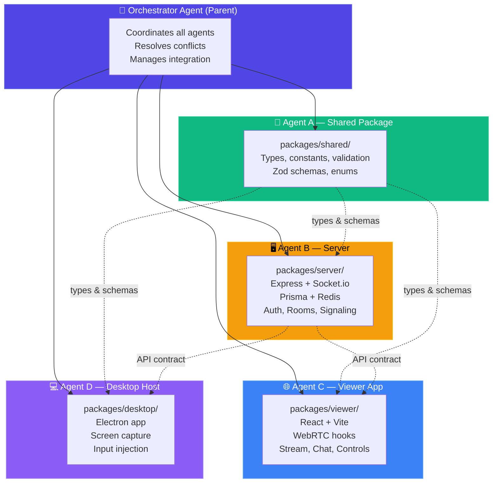
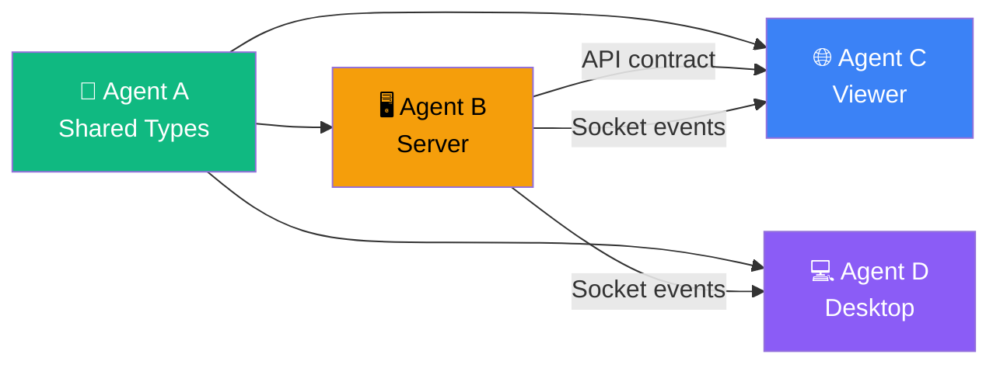
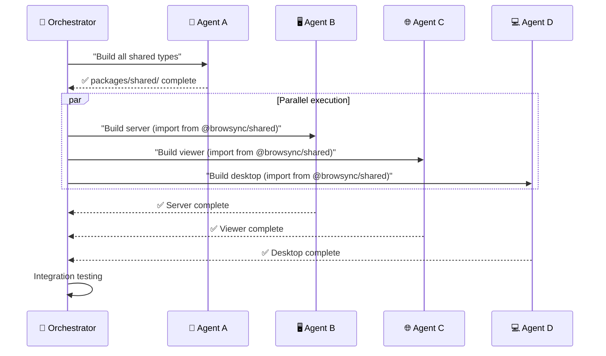

# BrowSync — Multi-Agent Development Workflow

> **How AI agents collaborate to build BrowSync in parallel.**
> This document is the master coordination plan. Each agent owns a component, works independently, and integrates at defined checkpoints.

---

## 1. Agent Architecture Overview



---

## 2. Agent Roster & Responsibilities

| Agent | Name | Component | Directory | Primary Responsibility |
|-------|------|-----------|-----------|----------------------|
| 🧠 | **Orchestrator** | Root | `browsync/` | Coordination, integration, conflict resolution, monorepo config |
| 🔧 | **Agent A** | Shared Package | `packages/shared/` | TypeScript types, Zod validation schemas, constants, enums |
| 🖥️ | **Agent B** | Signaling Server | `packages/server/` | Express REST API, Socket.io events, Prisma ORM, Redis, Auth |
| 🌐 | **Agent C** | Viewer Web App | `packages/viewer/` | React UI, WebRTC hooks, Stream component, Chat, Controls |
| 💻 | **Agent D** | Desktop Host App | `packages/desktop/` | Electron app, screen capture, WebRTC encoder, input injection |

---

## 3. File Ownership Rules

> [!IMPORTANT]
> Each agent **ONLY** writes files within its assigned directory. No agent may modify another agent's files. The Orchestrator owns root-level files.

### Orchestrator Owns
```
browsync/
├── package.json              ← monorepo root
├── tsconfig.json             ← root TypeScript config
├── .eslintrc.js              ← shared linting rules
├── .prettierrc               ← formatting rules
├── .gitignore
├── README.md
├── docker-compose.yml        ← local dev (PostgreSQL + Redis)
└── .github/workflows/        ← CI/CD pipelines
```

### Agent A Owns — `packages/shared/`
```
packages/shared/
├── package.json
├── tsconfig.json
├── src/
│   ├── index.ts              ← barrel export
│   ├── types/
│   │   ├── user.ts           ← User, Session types
│   │   ├── room.ts           ← Room, RoomMember types
│   │   ├── chat.ts           ← ChatMessage, Reaction types
│   │   ├── control.ts        ← ControlRequest, InputEvent types
│   │   ├── webrtc.ts         ← RTCOffer, RTCAnswer, ICECandidate types
│   │   └── socket-events.ts  ← All Socket.io event name constants + payload types
│   ├── schemas/
│   │   ├── auth.schema.ts    ← Zod: register, login validation
│   │   ├── room.schema.ts    ← Zod: room creation, join validation
│   │   ├── chat.schema.ts    ← Zod: message, reaction validation
│   │   └── control.schema.ts ← Zod: control request validation
│   ├── constants/
│   │   ├── events.ts         ← Socket event name constants
│   │   ├── config.ts         ← Default config values (max viewers, bitrate tiers, etc.)
│   │   └── errors.ts         ← Error codes and messages
│   └── enums/
│       ├── quality.ts        ← QualityPreset enum
│       ├── room-status.ts    ← RoomStatus enum
│       └── member-role.ts    ← MemberRole enum
```

### Agent B Owns — `packages/server/`
```
packages/server/
├── package.json
├── tsconfig.json
├── prisma/
│   ├── schema.prisma         ← PostgreSQL models
│   └── seed.ts               ← Dev seed data
├── src/
│   ├── index.ts              ← Entry point (Express + Socket.io)
│   ├── config/
│   │   ├── env.ts            ← Environment variables
│   │   ├── database.ts       ← Prisma client singleton
│   │   └── redis.ts          ← Redis client singleton
│   ├── middleware/
│   │   ├── auth.middleware.ts ← JWT verification middleware
│   │   ├── rate-limit.ts     ← Rate limiting middleware
│   │   └── error-handler.ts  ← Global error handler
│   ├── routes/
│   │   ├── auth.routes.ts    ← /api/auth/* endpoints
│   │   ├── room.routes.ts    ← /api/rooms/* endpoints
│   │   └── user.routes.ts    ← /api/users/* endpoints
│   ├── services/
│   │   ├── auth.service.ts   ← Registration, login, JWT logic
│   │   ├── room.service.ts   ← Room CRUD, code generation
│   │   └── user.service.ts   ← User profile management
│   ├── socket/
│   │   ├── index.ts          ← Socket.io server setup
│   │   ├── room.handler.ts   ← Room join/leave/close events
│   │   ├── rtc.handler.ts    ← WebRTC signaling relay
│   │   ├── chat.handler.ts   ← Chat message/reaction events
│   │   ├── control.handler.ts← Control request/grant/revoke
│   │   └── presence.handler.ts← Heartbeat, online status
│   └── utils/
│       ├── jwt.ts            ← JWT sign/verify helpers
│       ├── room-code.ts      ← 6-char code generator
│       └── redis-keys.ts     ← Redis key builders
```

### Agent C Owns — `packages/viewer/`
```
packages/viewer/
├── package.json
├── tsconfig.json
├── vite.config.ts
├── index.html
├── public/
│   └── favicon.svg
├── src/
│   ├── main.tsx              ← React entry point
│   ├── App.tsx               ← Router + layout
│   ├── index.css             ← Global styles + design tokens
│   ├── pages/
│   │   ├── Landing.tsx       ← Landing/marketing page
│   │   ├── Dashboard.tsx     ← User dashboard
│   │   ├── Room.tsx          ← Active room view (viewer)
│   │   └── NotFound.tsx      ← 404 page
│   ├── components/
│   │   ├── Stream.tsx        ← Video element for WebRTC stream
│   │   ├── Controls.tsx      ← Viewer control bar (request control, fullscreen)
│   │   ├── Chat.tsx          ← Real-time chat panel
│   │   ├── Reactions.tsx     ← Floating emoji reactions
│   │   ├── AccessToast.tsx   ← Host approval/deny toast
│   │   ├── QualityBadge.tsx  ← Connection quality indicator
│   │   ├── ViewerList.tsx    ← Online viewers panel
│   │   ├── AuthModal.tsx     ← Login/register modal
│   │   ├── RoomCreate.tsx    ← Room creation modal
│   │   └── ui/              ← Reusable primitives (Button, Input, Modal, Toast)
│   ├── hooks/
│   │   ├── useWebRTC.ts      ← WebRTC peer connection management
│   │   ├── useSocket.ts      ← Socket.io connection + event binding
│   │   ├── useChat.ts        ← Chat state management
│   │   ├── useControl.ts     ← Control request/release logic
│   │   ├── useAuth.ts        ← Auth state + JWT management
│   │   └── useRoom.ts        ← Room state management
│   ├── lib/
│   │   ├── api.ts            ← REST API client (fetch wrapper)
│   │   ├── socket.ts         ← Socket.io client singleton
│   │   └── webrtc-config.ts  ← ICE servers, codec preferences
│   └── stores/
│       └── auth.store.ts     ← Auth state (Zustand or Context)
```

### Agent D Owns — `packages/desktop/`
```
packages/desktop/
├── package.json
├── tsconfig.json
├── electron-builder.yml
├── src/
│   ├── main/
│   │   ├── index.ts          ← Electron main process entry
│   │   ├── capture.ts        ← getDisplayMedia screen/tab capture
│   │   ├── encoder.ts        ← WebRTC peer connection + encoding
│   │   ├── input.ts          ← uiohook-napi mouse/keyboard injection
│   │   ├── ipc.ts            ← IPC handlers (main ↔ renderer)
│   │   └── tray.ts           ← System tray icon + menu
│   ├── renderer/
│   │   ├── index.html        ← Renderer HTML
│   │   ├── index.tsx         ← Renderer entry point
│   │   ├── App.tsx           ← Host UI (room info, viewer list, controls)
│   │   ├── components/
│   │   │   ├── HostControls.tsx  ← Start/stop stream, end session
│   │   │   ├── ViewerPanel.tsx   ← Connected viewers + access queue
│   │   │   ├── AccessToast.tsx   ← Allow/deny control request
│   │   │   ├── CapturePreview.tsx← Live preview of captured screen
│   │   │   └── StatusBar.tsx     ← Connection status, bitrate, viewer count
│   │   ├── hooks/
│   │   │   ├── useCapture.ts     ← Screen capture management
│   │   │   ├── useHostWebRTC.ts  ← Host-side WebRTC (multiple peers)
│   │   │   └── useInputInjection.ts ← Input event handler
│   │   └── styles/
│   │       └── host.css          ← Host app styles
│   └── preload/
│       └── preload.ts        ← Electron preload script (contextBridge)
```

---

## 4. Execution Sequence & Dependencies

```mermaid
gantt
    title BrowSync Multi-Agent Build Sequence
    dateFormat X
    axisFormat %s

    section Agent A (Shared)
    Types & Enums           :a1, 0, 2
    Zod Schemas             :a2, 2, 2
    Constants & Exports     :a3, 4, 1

    section Agent B (Server)
    Wait for shared types   :crit, b0, 0, 2
    Prisma schema & DB      :b1, 2, 2
    Auth routes & JWT       :b2, 4, 2
    Room routes & service   :b3, 6, 2
    Socket.io handlers      :b4, 8, 3
    Redis integration       :b5, 8, 3

    section Agent C (Viewer)
    Wait for shared types   :crit, c0, 0, 2
    Vite + React setup      :c1, 2, 1
    Design system & CSS     :c2, 3, 2
    Landing + Auth pages    :c3, 5, 2
    WebRTC hooks            :c4, 5, 3
    Stream + Chat UI        :c5, 8, 3
    Controls + Reactions    :c6, 11, 2

    section Agent D (Desktop)
    Wait for shared types   :crit, d0, 0, 2
    Electron setup          :d1, 2, 2
    Screen capture          :d2, 4, 2
    WebRTC encoder          :d3, 6, 3
    Input injection         :d4, 9, 3
    Host UI                 :d5, 9, 3

    section Integration
    API contract test       :int1, 11, 1
    E2E integration test    :int2, 12, 1
```



### Dependency Graph



> [!IMPORTANT]
> **Agent A must complete first.** Agents B, C, and D all depend on the shared types package. Once Agent A delivers `packages/shared/`, the other three agents can work **fully in parallel**.

---

## 5. Sprint-Level Agent Assignments

### Sprint 1 — Foundation (Weeks 1–2)

| Task | Assigned Agent | Depends On |
|------|---------------|------------|
| Monorepo setup (root package.json, tsconfig) | 🧠 Orchestrator | — |
| All TypeScript types & interfaces | 🔧 Agent A | — |
| All Zod validation schemas | 🔧 Agent A | — |
| All enums & constants | 🔧 Agent A | — |
| Socket event name constants | 🔧 Agent A | — |
| Prisma schema + initial migration | 🖥️ Agent B | Agent A types |
| Express server skeleton + health check | 🖥️ Agent B | Agent A types |
| Redis client setup | 🖥️ Agent B | — |
| Vite + React project init | 🌐 Agent C | — |
| Design system (CSS tokens, variables) | 🌐 Agent C | — |
| Electron project init | 💻 Agent D | — |

### Sprint 2 — Auth & Rooms (Weeks 3–4)

| Task | Assigned Agent | Depends On |
|------|---------------|------------|
| Auth routes (register, login, refresh) | 🖥️ Agent B | Agent A schemas |
| JWT middleware | 🖥️ Agent B | — |
| Room CRUD routes | 🖥️ Agent B | Agent A schemas |
| Room code generator | 🖥️ Agent B | — |
| AuthModal component (login/register UI) | 🌐 Agent C | Agent A types |
| useAuth hook | 🌐 Agent C | Agent B API |
| Dashboard page | 🌐 Agent C | Agent B API |
| RoomCreate modal | 🌐 Agent C | Agent B API |

### Sprint 3 — WebRTC Signaling (Weeks 5–6)

| Task | Assigned Agent | Depends On |
|------|---------------|------------|
| Socket.io server setup | 🖥️ Agent B | Agent A events |
| RTC signaling handlers (offer/answer/ICE) | 🖥️ Agent B | Agent A types |
| Room join/leave socket handlers | 🖥️ Agent B | Agent A types |
| useWebRTC hook | 🌐 Agent C | Agent A types |
| useSocket hook | 🌐 Agent C | Agent A events |
| Stream component (video element) | 🌐 Agent C | useWebRTC |
| Room page (viewer view) | 🌐 Agent C | useSocket, useWebRTC |

### Sprint 4 — Host App & Streaming (Weeks 7–8)

| Task | Assigned Agent | Depends On |
|------|---------------|------------|
| Screen capture module (getDisplayMedia) | 💻 Agent D | — |
| WebRTC encoder (RTCPeerConnection + tracks) | 💻 Agent D | Agent A types |
| Host UI (room code, viewer count, controls) | 💻 Agent D | — |
| System tray integration | 💻 Agent D | — |
| IPC bridge (main ↔ renderer) | 💻 Agent D | — |
| Preload script (contextBridge) | 💻 Agent D | — |

### Sprint 5 — Control System & Chat (Weeks 9–10)

| Task | Assigned Agent | Depends On |
|------|---------------|------------|
| Control request socket handlers | 🖥️ Agent B | Agent A types |
| Chat message socket handlers | 🖥️ Agent B | Agent A types |
| Redis access queue + controller | 🖥️ Agent B | — |
| Presence heartbeat handler | 🖥️ Agent B | — |
| Chat component | 🌐 Agent C | Agent B socket events |
| Reactions component (floating emojis) | 🌐 Agent C | Agent B socket events |
| Controls component (request control) | 🌐 Agent C | Agent B socket events |
| useChat hook | 🌐 Agent C | Agent A types |
| useControl hook | 🌐 Agent C | Agent A types |
| Input injection module (uiohook-napi) | 💻 Agent D | — |
| Data channel for input events | 💻 Agent D | Agent A types |
| AccessToast component (host side) | 💻 Agent D | Agent B socket events |
| Coordinate normalization (viewer→host) | 💻 Agent D | Agent A types |

---

## 6. Inter-Agent Communication Protocol

### 6.1 Shared Contract (Agent A → All)

Agent A produces the **single source of truth** for all data shapes:

```typescript
// What Agent A exports (consumed by B, C, D):
export type { User, Room, RoomMember, Session } from './types/user';
export type { ChatMessage, Reaction } from './types/chat';
export type { ControlRequest, InputEvent, MouseInput, KeyboardInput } from './types/control';
export type { RTCOffer, RTCAnswer, ICECandidate } from './types/webrtc';
export { SOCKET_EVENTS } from './constants/events';
export { registerSchema, loginSchema, roomCreateSchema } from './schemas/auth.schema';
export { QualityPreset, RoomStatus, MemberRole } from './enums';
```

### 6.2 API Contract (Agent B → Agent C, Agent D)

Agent B defines the REST + WebSocket contract that C and D consume:

| Contract | Format | Location |
|----------|--------|----------|
| REST API | OpenAPI-style types in `@browsync/shared` | `types/api.ts` |
| Socket events | Event name constants + payload types | `constants/events.ts` |
| Error codes | Standardized error enum | `constants/errors.ts` |

### 6.3 Handoff Procedure



---

## 7. Integration Checkpoints

| Checkpoint | When | What's Verified | Agents Involved |
|-----------|------|-----------------|-----------------|
| **CP1** | After Sprint 1 | Shared types compile, server starts, viewer loads | A → B, C |
| **CP2** | After Sprint 2 | Auth flow works E2E (register → login → dashboard) | B ↔ C |
| **CP3** | After Sprint 3 | WebRTC connection establishes between viewer ↔ host | B ↔ C ↔ D |
| **CP4** | After Sprint 4 | Host streams screen to viewer successfully | D → B → C |
| **CP5** | After Sprint 5 | Full MVP: stream + chat + control all working | All agents |

---

## 8. Conflict Resolution Rules

> [!WARNING]
> If two agents need to modify the same file or type, the Orchestrator resolves the conflict.

1. **Type conflicts**: Agent A is the authority on all shared types. If B, C, or D need a type change, they request it via the Orchestrator.
2. **API contract changes**: Agent B proposes, Orchestrator approves, then notifies C and D.
3. **Socket event changes**: Same as API — Agent B proposes, Orchestrator distributes.
4. **Build failures**: If an agent's code breaks due to another agent's change, the Orchestrator identifies the root cause and assigns the fix.

---

## 9. Agent Instructions Summary

### 🔧 Agent A — Shared Package
> **Your job**: Create every TypeScript type, interface, enum, constant, and Zod validation schema that the entire BrowSync system needs. You are the **foundation**. Every other agent imports from you. Be exhaustive — if a data shape exists anywhere in the system, define it here.

### 🖥️ Agent B — Signaling Server
> **Your job**: Build the complete backend — Express REST API for auth and rooms, Socket.io server for real-time signaling, Prisma ORM for PostgreSQL, Redis for ephemeral data. Import all types from `@browsync/shared`. You are the **brain** of the system.

### 🌐 Agent C — Viewer Web App
> **Your job**: Build the React viewer application that friends use in their browser. Create a stunning dark-themed UI with glassmorphism, smooth animations, and premium design. Build WebRTC hooks, chat, controls, reactions. Import all types from `@browsync/shared`. You are the **face** of the product.

### 💻 Agent D — Desktop Host App
> **Your job**: Build the Electron desktop app that the host runs to share their screen. Implement screen capture via `getDisplayMedia()`, WebRTC encoding, input injection via `uiohook-napi`, and the host control UI. Import all types from `@browsync/shared`. You are the **engine** of the system.

---

## 10. Quality Gates Per Agent

Each agent must satisfy these before marking their component complete:

| Gate | Requirement |
|------|------------|
| **Compiles** | `tsc --noEmit` passes with zero errors |
| **Lints** | `eslint` passes with zero errors |
| **Types** | All imports from `@browsync/shared` resolve correctly |
| **Tests** | Unit tests pass (if applicable) |
| **Documented** | Key functions have JSDoc comments |
| **No hardcoded values** | All magic numbers/strings use shared constants |

---

## 11. Document Cross-Reference

This multi-agent workflow references and is referenced by:

| Document | How It Relates |
|----------|---------------|
| **01_PRD** | Defines WHAT to build — agents use this for feature requirements |
| **02_TRD** | Defines HOW to build — agents use this for technical specs |
| **03_UI/UX Design** | Agent C follows this for all visual design decisions |
| **04_App Flow** | All agents reference this for interaction sequences |
| **05_Backend Schema** | Agent B follows this for database and API design |
| **06_Implementation Plan** | Sprint tasks map directly to agent assignments in this doc |
| **07_Multi-Agent Workflow** | ← **You are here** — the coordination layer |

---

> [!TIP]
> **To use this workflow**: Start by running Agent A to completion. Then launch Agents B, C, and D simultaneously. The Orchestrator monitors progress and runs integration tests at each checkpoint.
